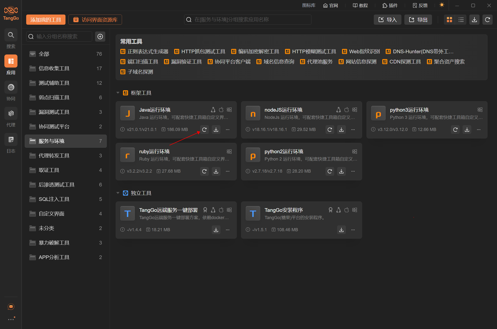
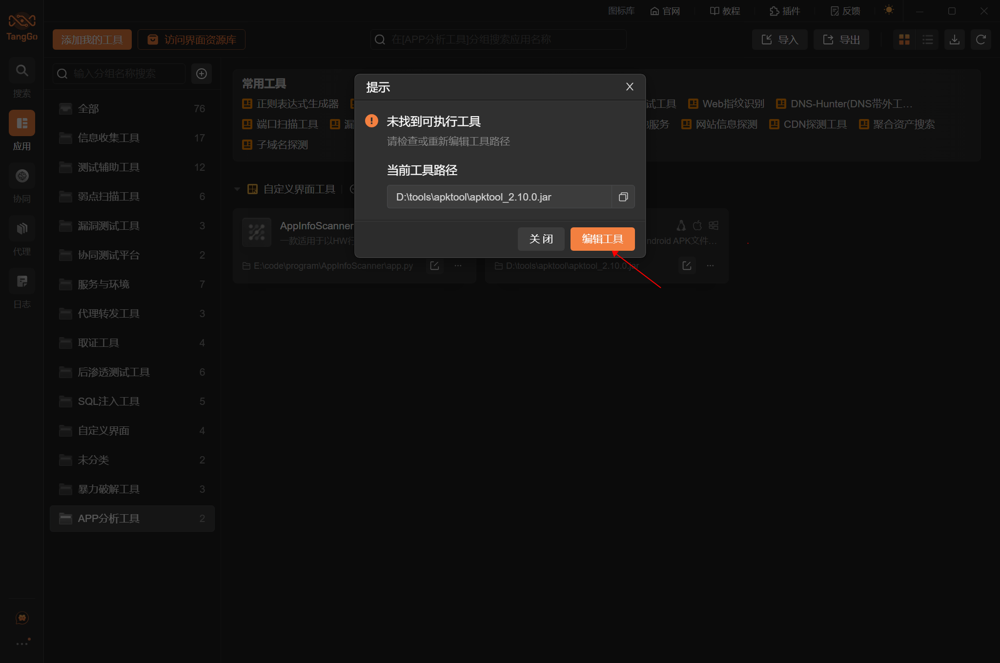
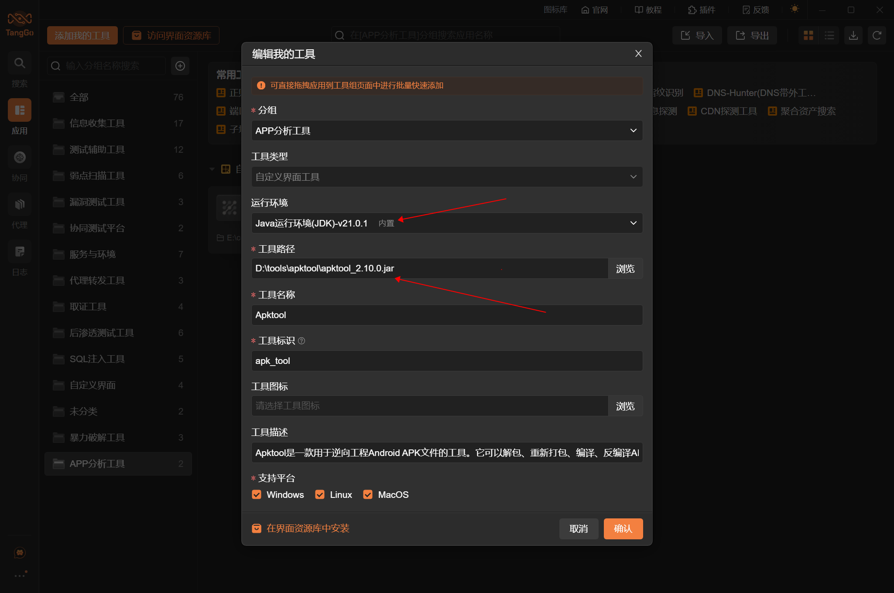
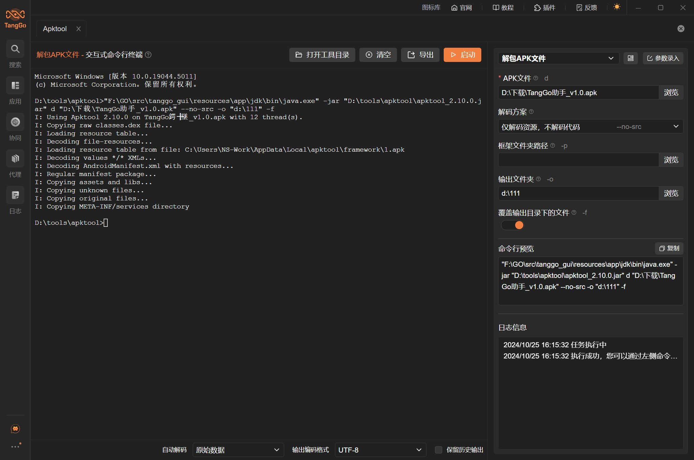
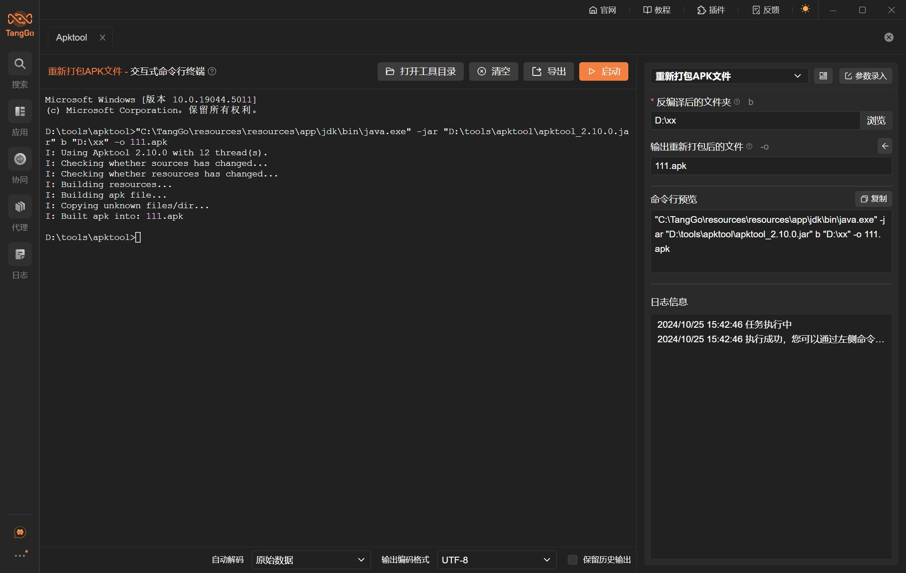

# Apktool

# 1. 简介
Apktool是一款用于逆向工程Android APK文件的工具。它可以解包、重新打包、编译、反编译APK文件，从而帮助开发者分析APK内部文件结构、修改资源等。

- 官网：[https://github.com/iBotPeaches/Apktool](https://github.com/iBotPeaches/Apktool)
- 支持的TangGo版本：v1.5.3+

# 2. 使用方法
- 安装界面：如果您是通过界面资源库进行安装的，免去此步骤。如果是本github下载安装，请在右上角点击导入，下载"Apktool自定义界面/Apktool.txt"进行导入，如下图所示：
  

- 下载工具：在Apktool的官方Github上[https://github.com/iBotPeaches/Apktool/releases](https://github.com/iBotPeaches/Apktool/releases)下载工具，并解压缩到某个文件夹（建议路径必要包含空格和中文字符，虽然我们已经做了处理，但是不确定某些工具还是存在不兼容情况）

- 安装JDK，Windows可以在应用中心的“服务与环境”中一键安装内置JDK，其他操作系统请自行安装和配置，如下图所示：
  
- 配置工具路径：通过搜索"Apktool"或在全部分组的自定义界面工具类中找到"Apktool"，双击或者点击右下角的编辑，修改Apktool的工具路径为您下载工具的存放路径：
  
  
- 使用工具：配置测试目标地址和参数，点击启动按钮，如下图所示：
  
  

