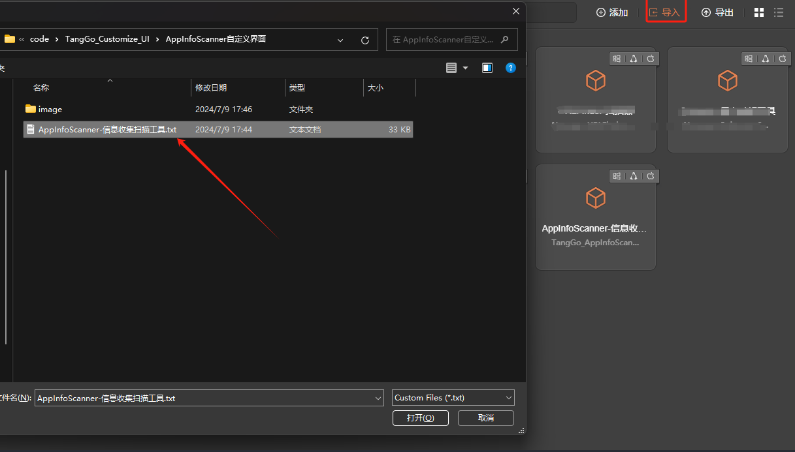
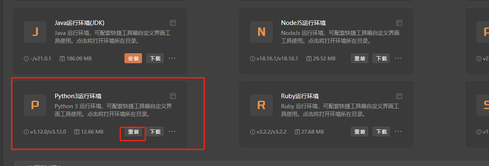
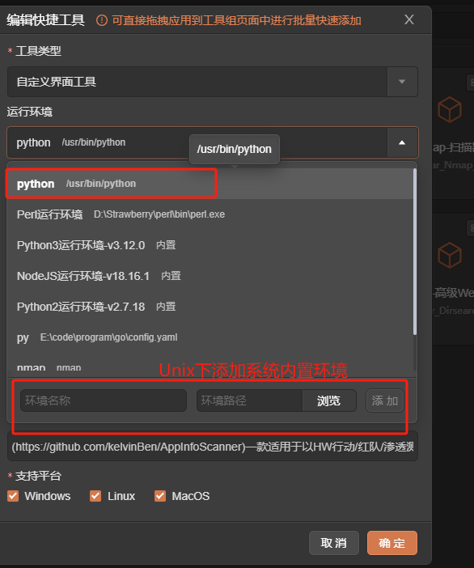
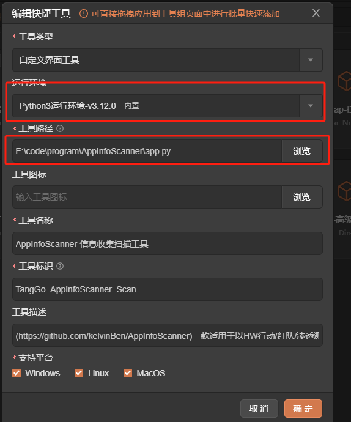
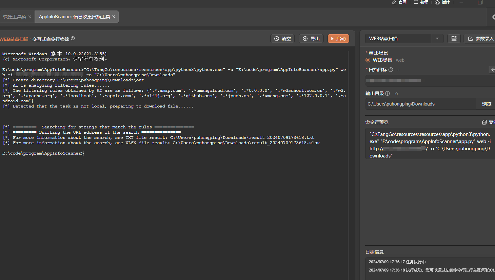
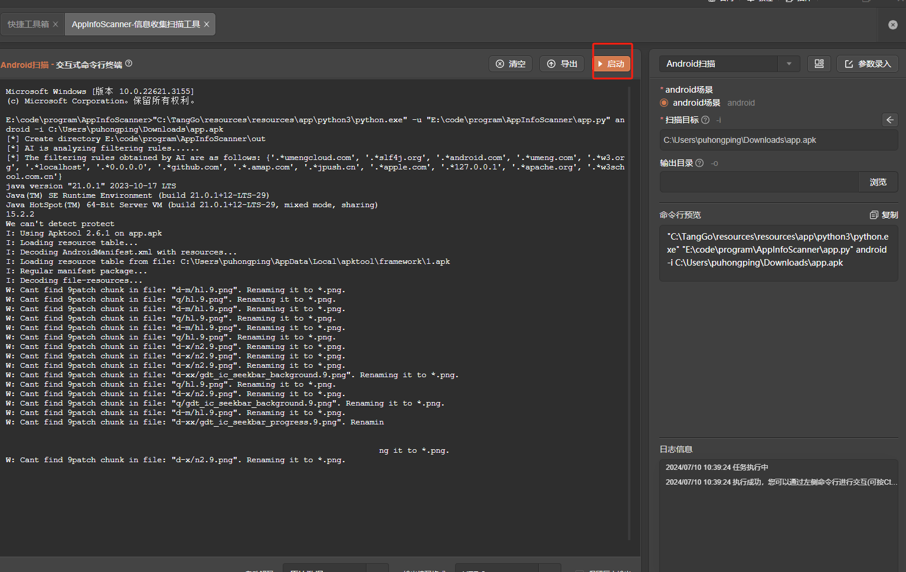

# AppInfoScanner

# 1. 简介
一款适用于以HW行动/红队/渗透测试团队为场景的移动端(Android、iOS、WEB、H5、静态网站)信息收集扫描工具，可以帮助渗透测试工程师、攻击队成员、红队成员快速收集到移动端或者静态WEB站点中关键的资产信息并提供基本的信息输出,如：Title、Domain、CDN、指纹信息、状态信息等。
## 环境说明
- 官网：[https://github.com/kelvinBen/AppInfoScanner](https://github.com/kelvinBen/AppInfoScanner)
- 工具下载地址:[https://github.com/kelvinBen/AppInfoScanner/releases](https://github.com/kelvinBen/AppInfoScanner/releases)
- Apk文件解析需要使用JAVA环境,JAVA版本1.8及以下
- Python3的运行环境
- 工具版本：v1.0.9+
- 支持的TangGo版本：v1.4.8+
# 2. 使用方法
- 安装界面：如果您是通过界面资源库进行安装的，免去此步骤。如果是本github下载安装，请在右上角点击导入，下载"AppInfoScanner自定义界面/AppInfoScanner-信息收集扫描工具.txt"进行导入，如下图所示：
  
- window下需安装下面步骤   
  1. 安装python内置环境，并双击打开   
    
  2. 下载AppInfoScanner最新版本,地址:[https://github.com/kelvinBen/AppInfoScanner/releases](https://github.com/kelvinBen/AppInfoScanner/releases)，解压
- unix下可使用自行安装的python和java    
- 修改AppInfoScanner-信息收集扫描工具 编辑环境和实际运行路径，并保存。
     

- 修改AppInfoScanner-信息收集扫描工具 编辑环境和实际运行路径，并保存      
 
- 打开工具，选择模板，配置参数，启动   
   
# 3. 运行截图

-  WEB站点扫描
  
-  Android扫描
  
