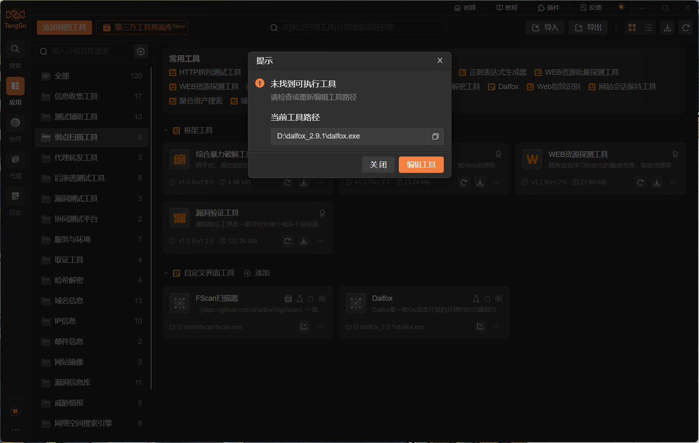
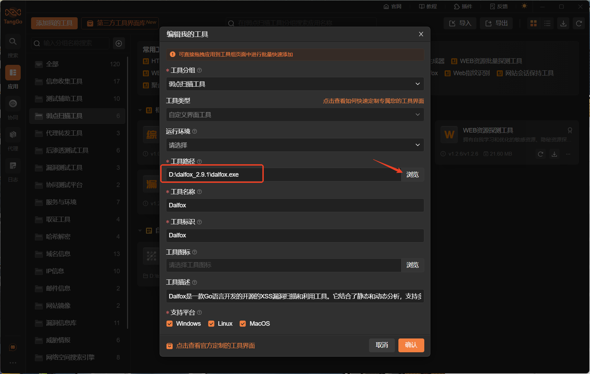
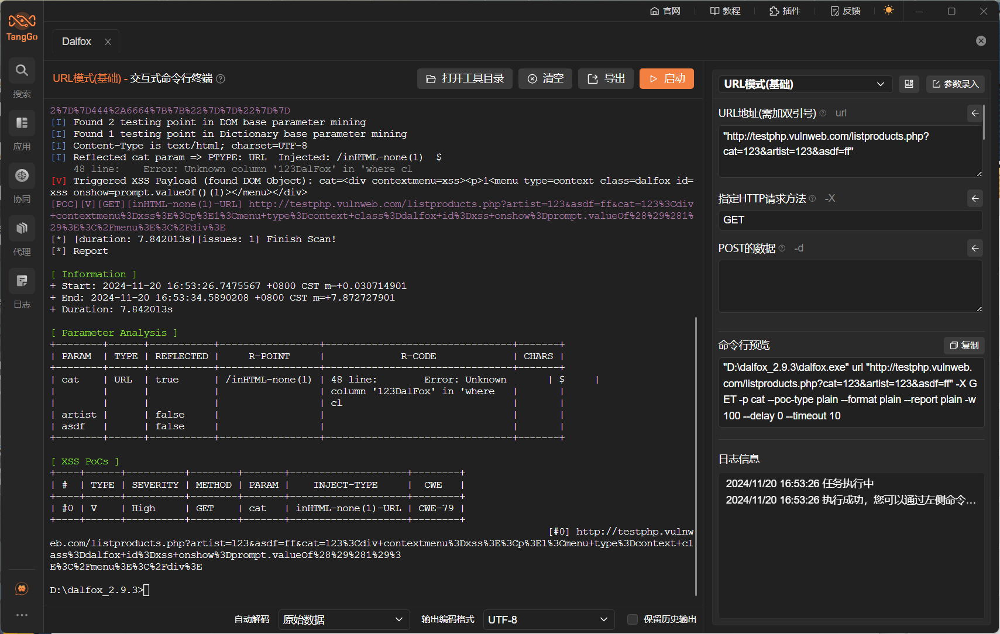
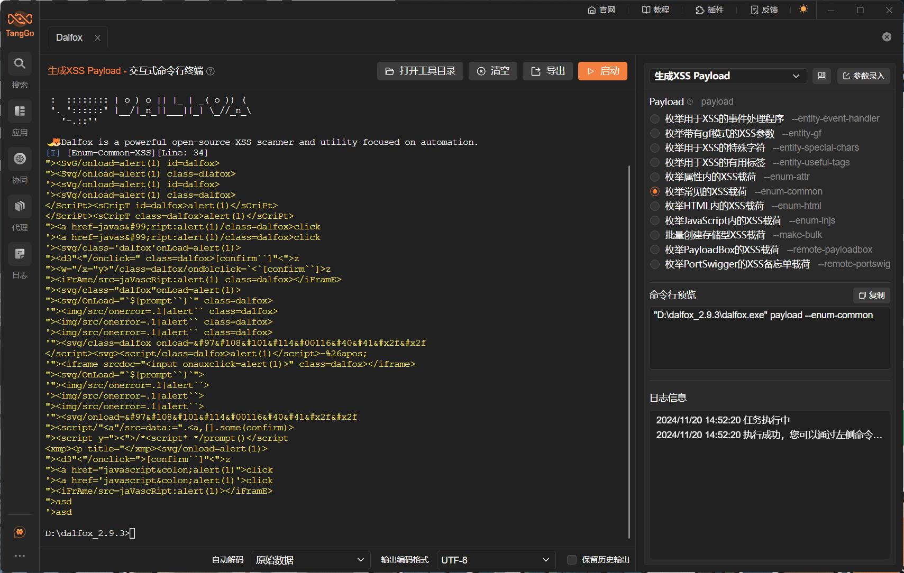

# KillWxapkg

# 1. 简介
Dalfox是一款Go语言开发的开源的XSS漏洞扫描和利用工具，它同时也支持基本的SQL注入、SSTI、开方式重定向、CRLF注入等漏洞的扫描。它支持URL、文件、管道、REST API等多种扫描模式，支持Blind XSS、DOM XSS的扫描，支持Payload生成，支持详细PoC和报告输出。它可自定义的参数非常广泛，可以根据用户需求深度定制化地进行XSS检测。

- 官网：[https://github.com/hahwul/dalfox](https://github.com/hahwul/dalfox)
- 支持的TangGo版本：v1.5.3+

# 2. 使用方法
- 安装界面：如果您是通过界面资源库进行安装的，免去此步骤。如果是本github下载安装，请在右上角点击导入，下载"Dalfox自定义界面/Dalfox.txt"进行导入，如下图所示：
  

- 下载工具：您可在Dalfox的官方Github上[https://github.com/hahwul/dalfox/releases](https://github.com/hahwul/dalfox/releases)下载已编译好的工具（您也可以下载源码自行编译），并解压缩到某个文件夹（建议路径必要包含空格和中文字符，虽然我们已经做了处理，但是不确定某些工具还是存在不兼容情况）
  - ubuntu下可以使用`sudo snap install dalfox`进行安装
  - macos可以执行`brew install dalfox`进行安装。
- 配置工具路径：通过搜索"Dalfox"或在全部分组的自定义界面工具类中找到"Dalfox"，双击或者点击右下角的编辑，修改Dalfox的工具路径为您下载工具的存放路径：
  
  
- 工具的参数说明文档：[https://dalfox.hahwul.com/docs/usage/](https://dalfox.hahwul.com/docs/usage/)
- 使用工具：配置测试目标地址和参数，点击启动按钮，如下图所示：
  
  
