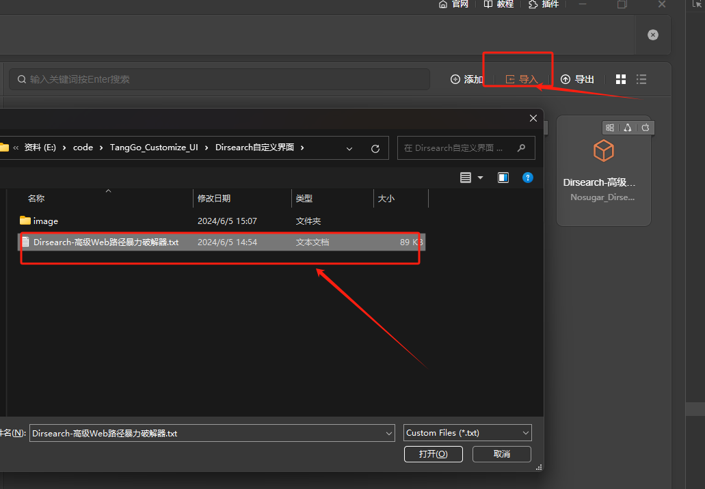
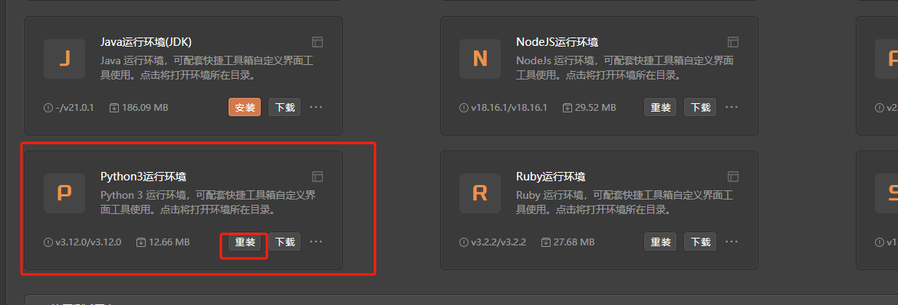
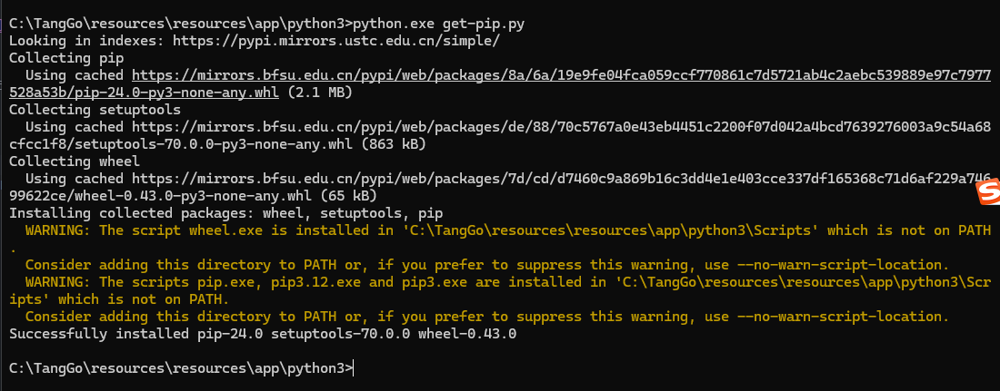
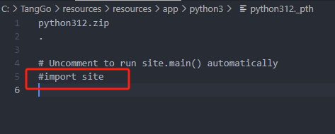
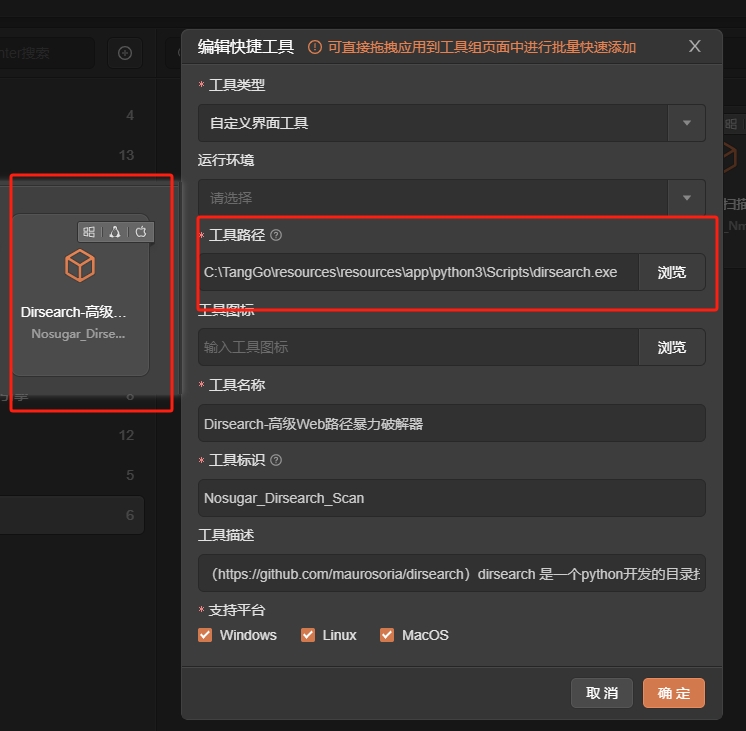
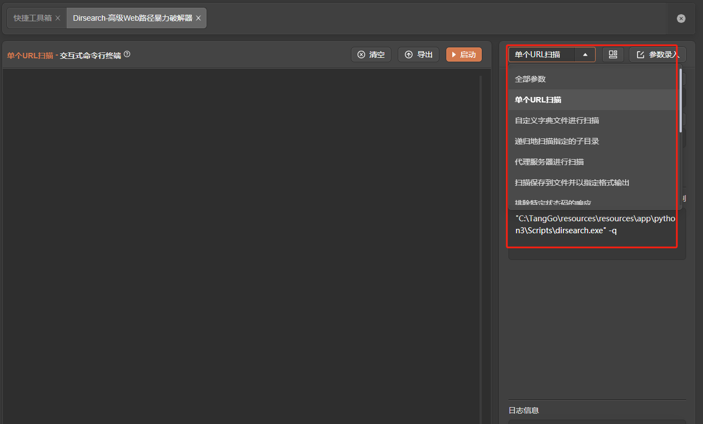
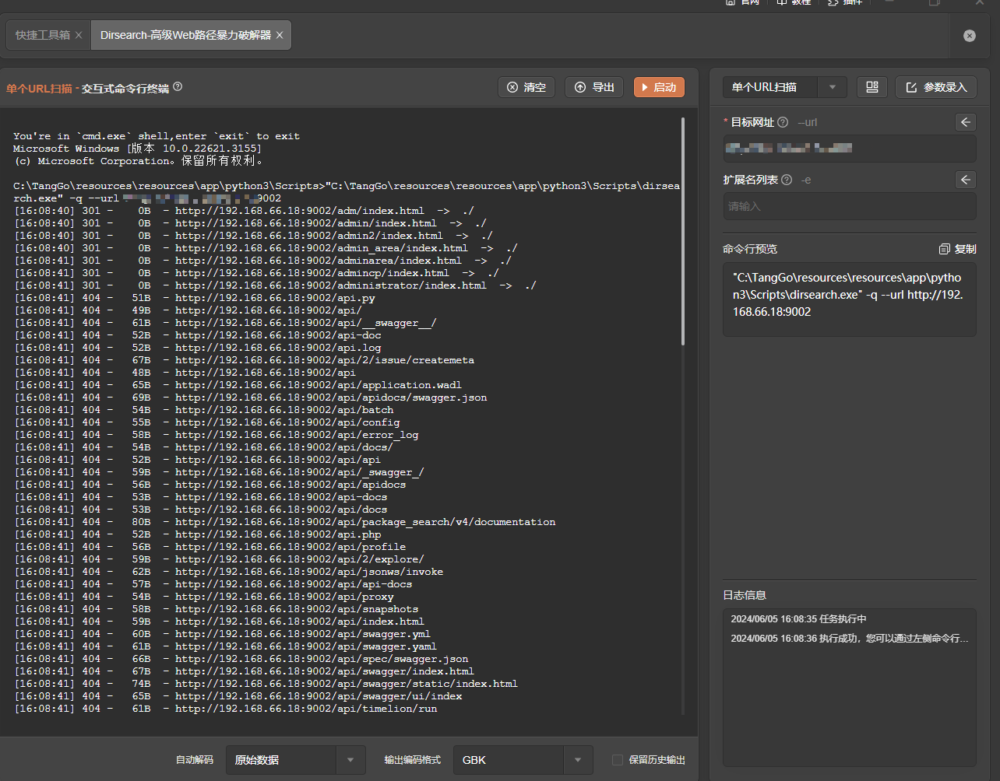
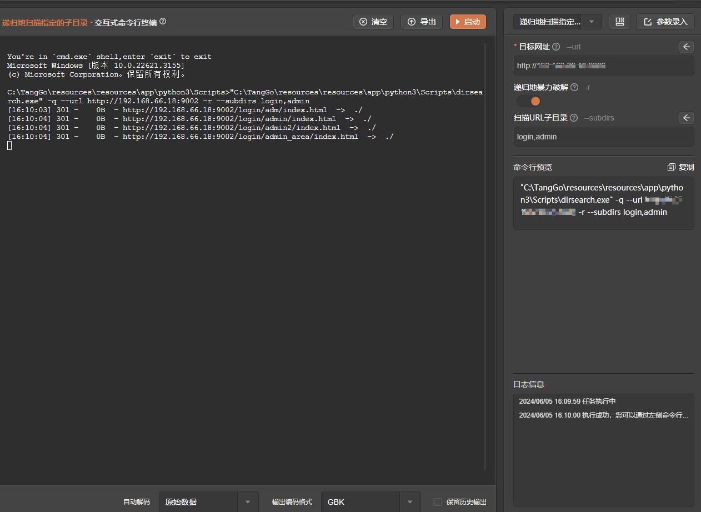
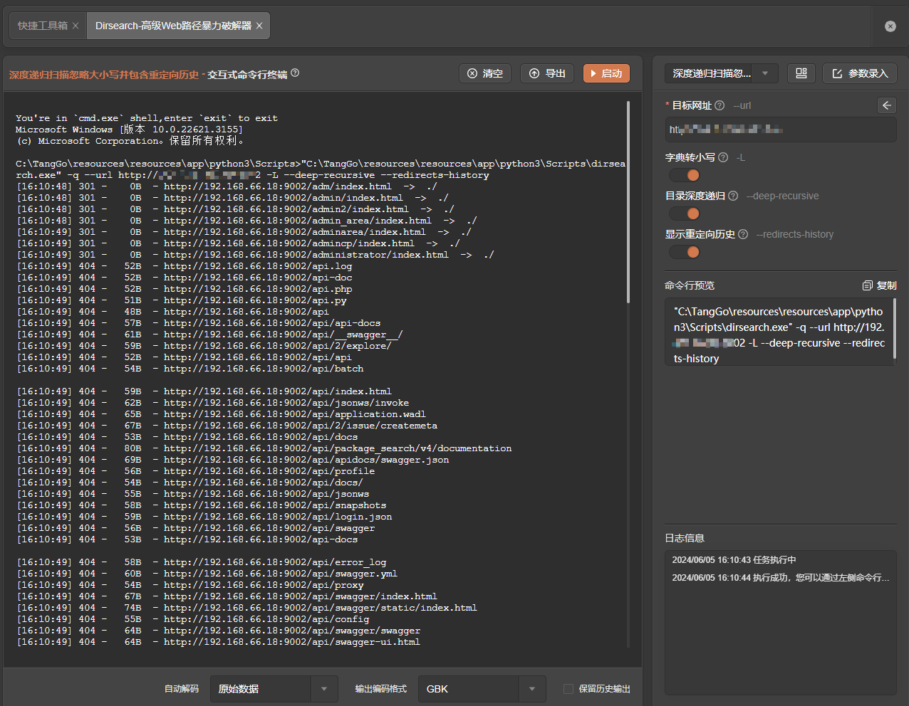

# Dirsearch

# 1. 简介
dirsearch 是一个python开发的目录扫描工具。和御剑之类的工具类似，用于扫描网站的敏感文件和目录从而找到突破口，它通过发送HTTP请求来尝试访问可能存在的路径，从而找到不列在网站目录页面上的隐藏资源。dirsearch可以在Windows上安装使用，也可以在kali直接安装使用。

Dirsearch 的主要特点包括：
- 多线程：Dirsearch 采用多线程方式进行目录扫描，充分利用系统资源提高扫描效率。
- 字典支持：它支持使用自定义字典文件来进行目录爆破，你可以使用自己的字典文件或使用内置的常用字典。（注：字典必须是文本文件）
- 支持多种形式的网页（asp，php）
- 支持HTTP代理
- 启发式检测无效的网页
- 指定扩展名：你可以选择限制扫描的文件扩展名范围，以便更加精确地进行目录扫描。
- 进度追踪：Dirsearch 提供实时进度追踪，你可以看到当前扫描的进度和已发现的目录和文件。
- 结果输出：完成扫描后，Dirsearch 会生成详细的扫描报告（纯文本，JSON），展示已发现的隐藏目录和文件。

- 官网：[https://github.com/maurosoria/dirsearch](https://github.com/maurosoria/dirsearch)
- 支持的TangGo版本：v1.4.8+
# 2. 使用方法
- 打开快捷工具，右上角点击导入，找到"Dirsearch自定义界面/Dirsearch-高级Web路径暴力破解器.txt"进行导入 
  
- 安装python内置环境，并双击打开 
  
- 安装python的pip 
  
- 在python安装目录找到python312._pth 这个文件，若存在 #import site 则删掉前面的 # 即可 
  
- 在python安装目录下运行 Scripts\pip.exe install dirsearch 得到dirsearch安装路径：Scripts\dirsearch.exe 
- 配置工具路径,在"自定义界面"分组找到"Dirsearch-高级Web路径暴力破解器"，点击编辑,修改工具路径为上面得到的安装路径：Scripts\dirsearch.exe 
 
- 打开工具，选择模板，配置参数，启动 
  
# 3. 运行截图

- 单个URL扫描 
  
- 递归地扫描指定的子目录 
  
- 深度递归扫描忽略大小写并包含重定向历史 
  