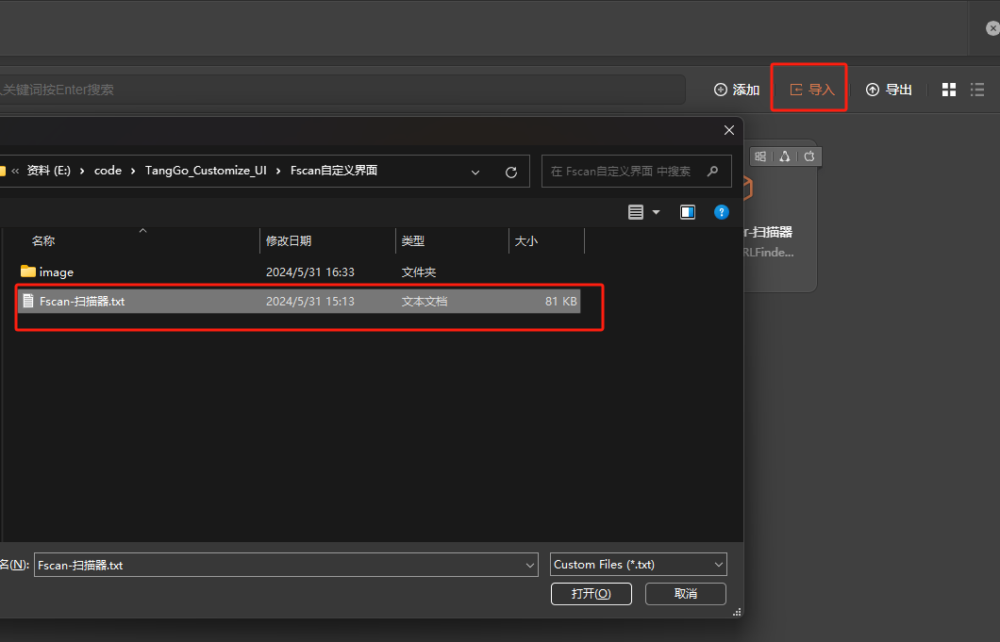
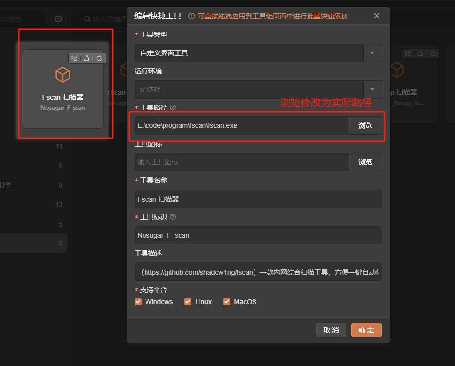
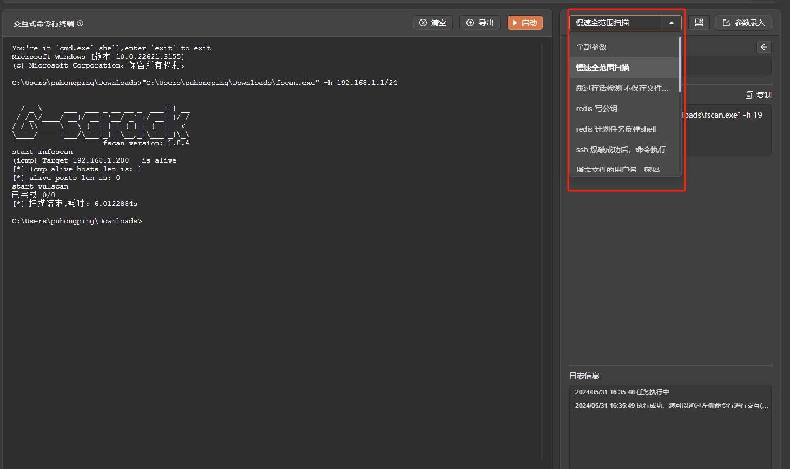
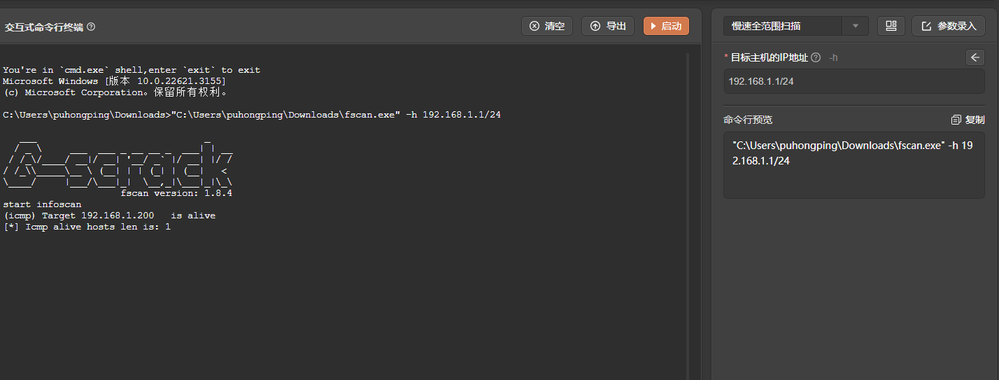
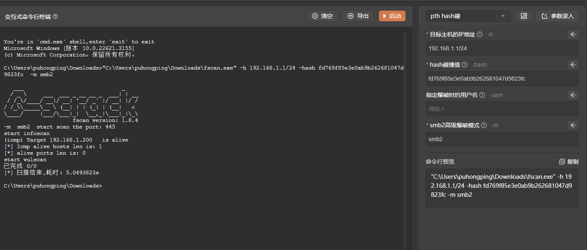
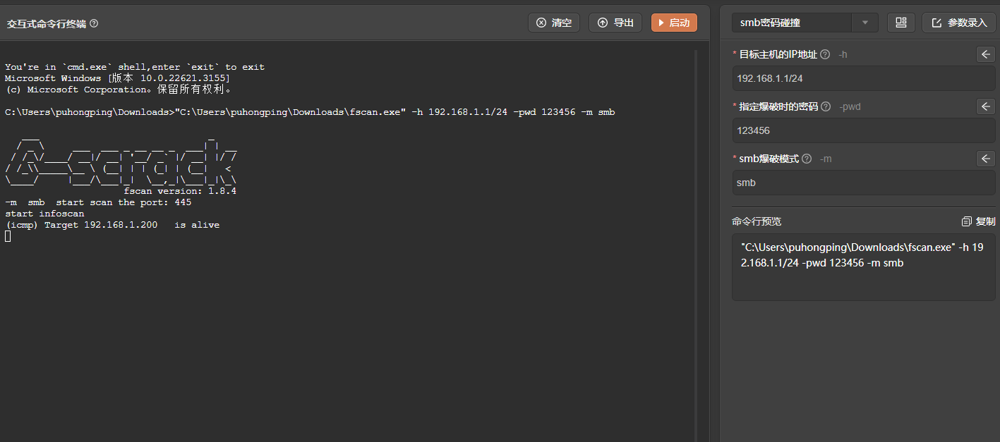
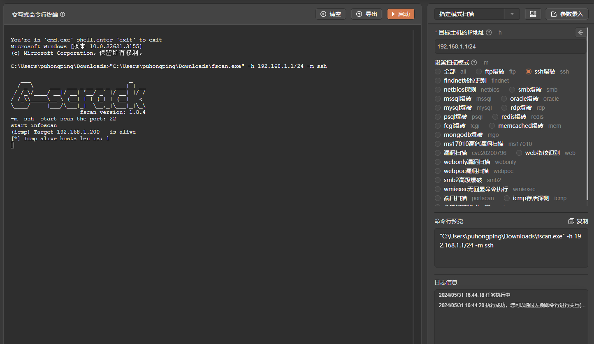

# fscan

# 1. 简介
一款内网综合扫描工具，方便一键自动化、全方位漏扫扫描。
支持主机存活探测、端口扫描、常见服务的爆破、ms17010、redis批量写公钥、计划任务反弹shell、读取win网卡信息、web指纹识别、web漏洞扫描、netbios探测、域控识别等功能。
- 官网：[https://github.com/shadow1ng/fscan](https://github.com/shadow1ng/fscan) 
- 工具版本： 1.8.4+
- 支持的TangGo版本：v1.4.8+
# 2. 使用方法
- 打开快捷工具，右上角点击导入，找到"Fscan自定义界/Fscan-扫描器.txt"进行导入
  
- 配置工具路径,在"自定义界面"分组找到"Fscan-扫描器"，点击编辑.
- 选择Fscan实际路径 通过[https://github.com/shadow1ng/fscan/releases](https://github.com/shadow1ng/fscan/releases)下载工具
  
- 打开工具，选择模板，配置参数，启动
  
# 3. 运行截图

- 慢速全范围扫描
  
- hash 碰撞
   
- smb密码碰撞
  
- 指定模式扫描
  