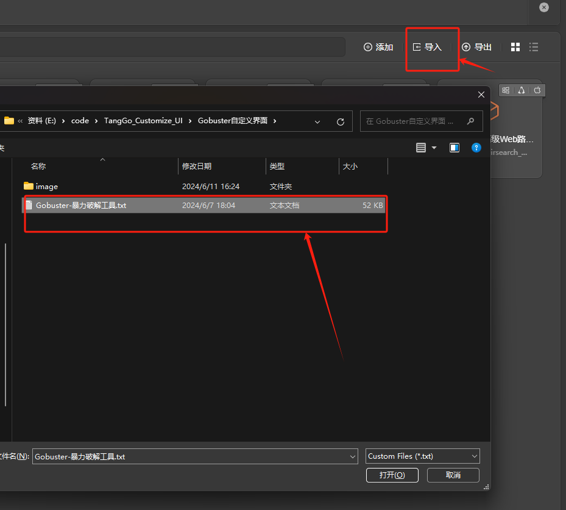
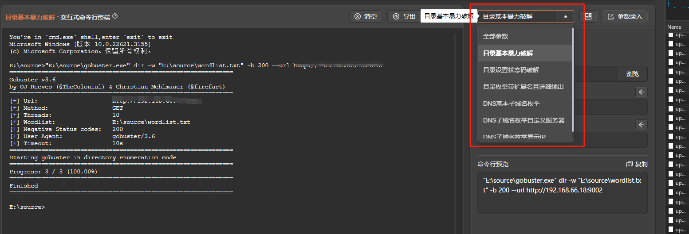
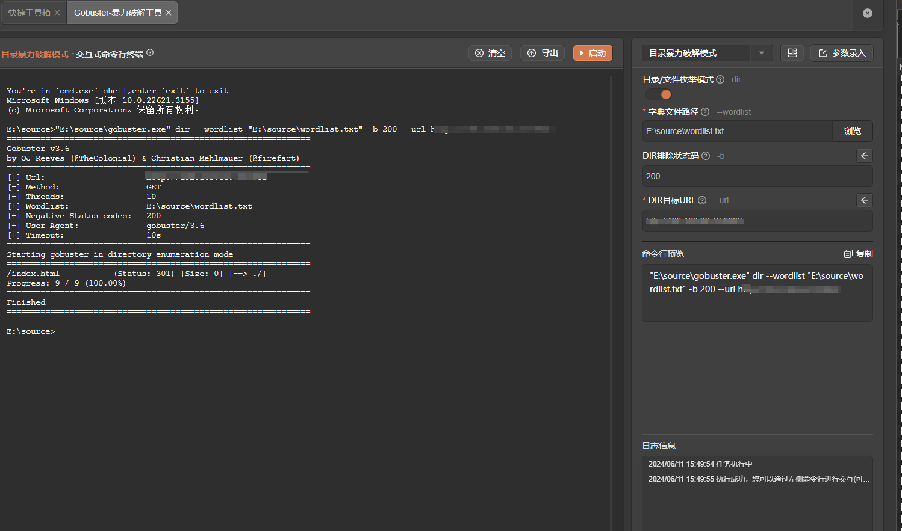
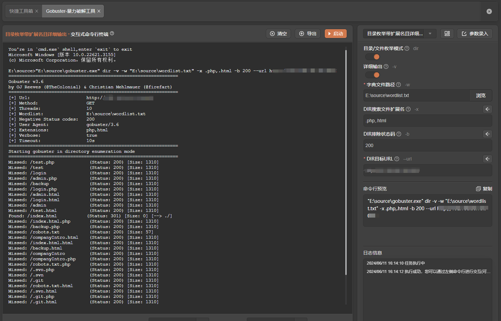
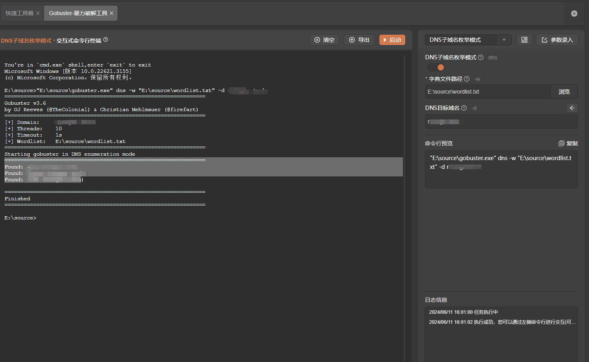
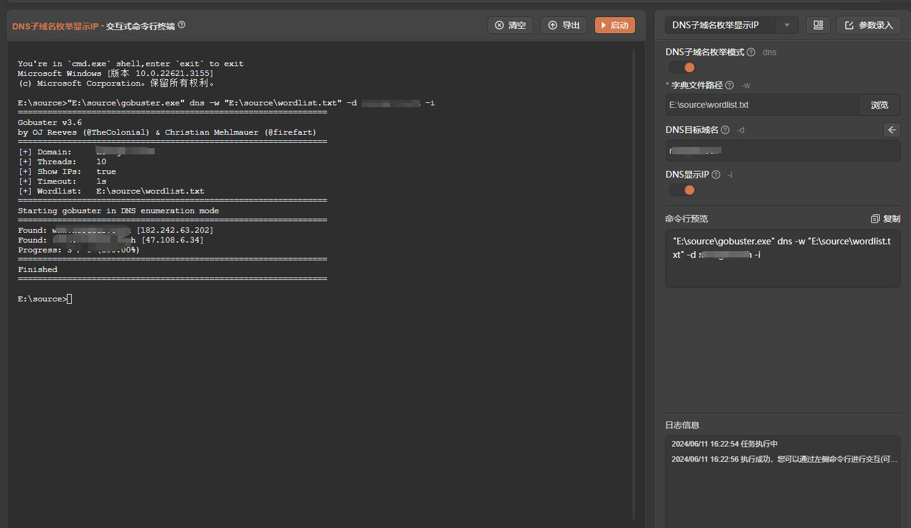
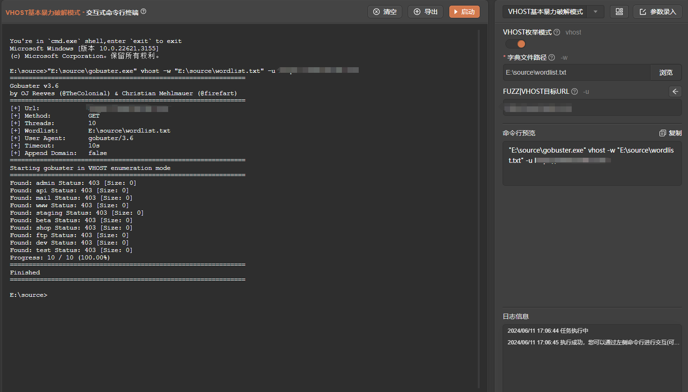
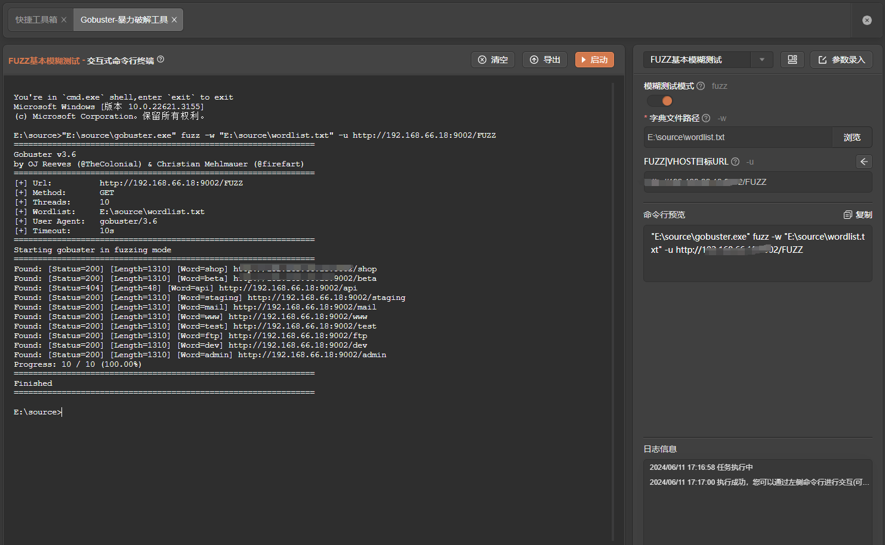

# Gobuster

# 1. 简介
Gobuster是一个用Go编写的工具，用于暴力破解网站的URI（目录和文件）、DNS子域、目标Web服务器上的虚拟主机名，以及扫描开放的Amazon S3和Google Cloud存储桶、TFTP服务器。
- 网站中的 URI（目录和文件）。
- DNS 子域（支持通配符）。
- 目标 Web 服务器上的虚拟主机名。
- 打开 Amazon S3 存储桶
- 打开 Google Cloud 存储桶
- TFTP 服务器
- 官网：[https://github.com/OJ/gobuster](https://github.com/OJ/gobuster)
- 工具版本：3.6
- 支持的TangGo版本：v1.4.8+
# 2. 使用方法
- 安装界面：如果您是通过界面资源库进行安装的，免去此步骤。如果是本github下载安装，请在主界面右上角点击导入，下载"Gobuster自定义界面/Gobuster-暴力破解工具.txt"进行导入 
  
- 下载工具：请在官方Github下载工具，下载地址：[https://github.com/OJ/gobuster/releases](https://github.com/OJ/gobuster/releases)，下载后请将工具放在一个不包含空格和中文字符的目录下
- 配置工具路径：在"暴力破解工具"分组或"自定义界面"分组找到"Gobuster-暴力破解工具"，点击编辑，配置路径为您下载的工具的路径：
  
- 打开工具，选择模板，配置参数，启动 
  
# 3. 运行截图
- 目录暴力破解模式 
  
- 目录枚举带扩展名且详细输出 
  
- DNS子域名枚举模式 
  
- DNS子域名枚举显示IP 
  
- VHOST基本暴力破解模式 
  
- FUZZ基本模糊测试 
  
