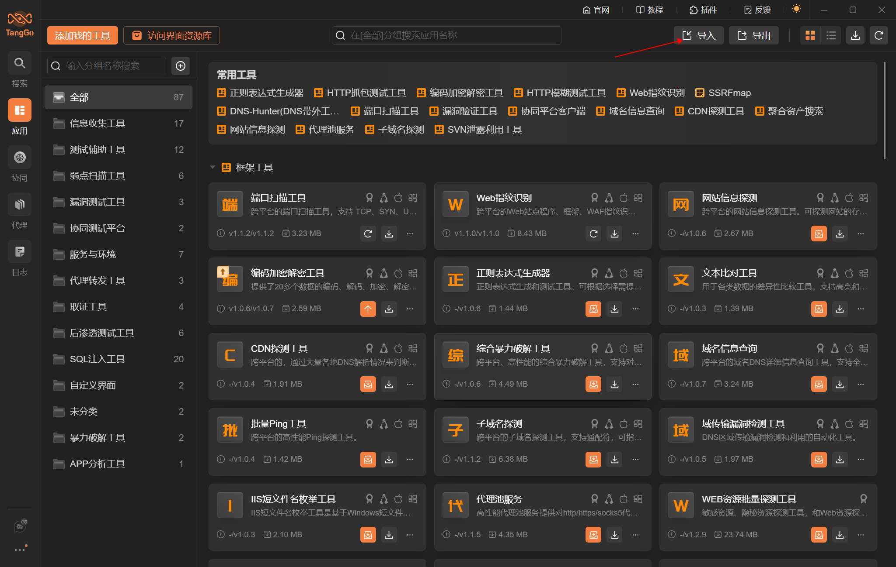
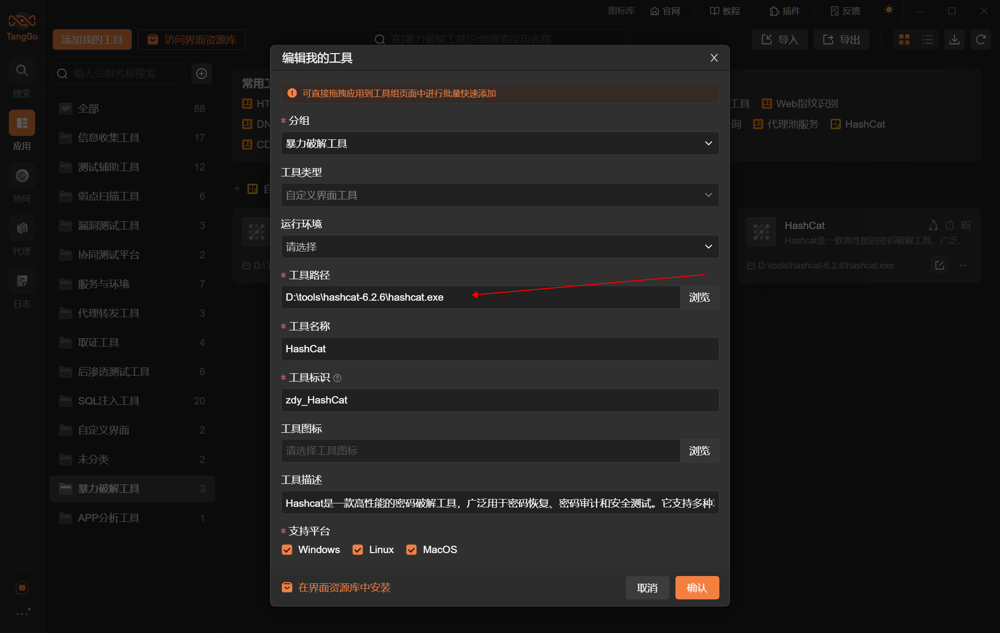
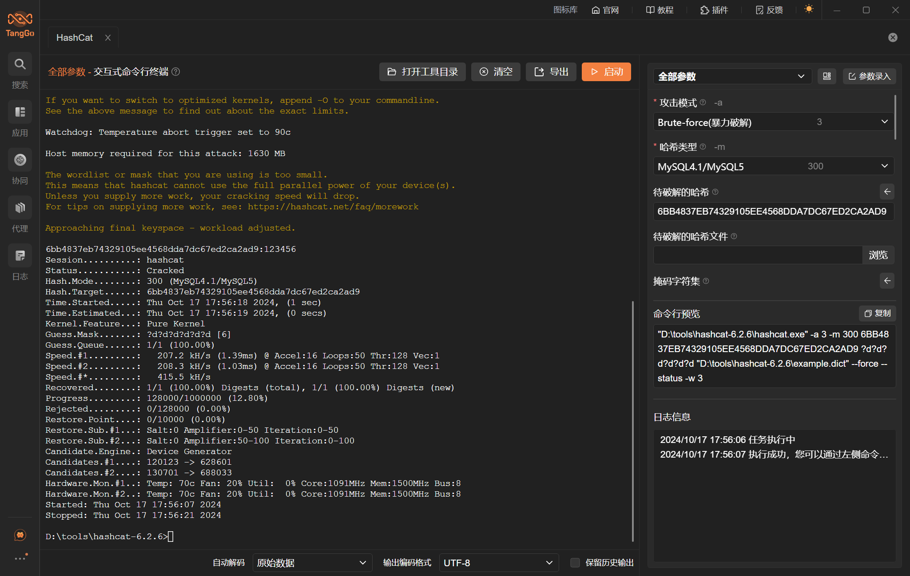
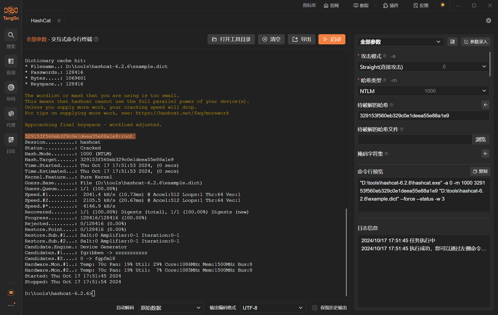

# HashCat

# 1. 简介
Hashcat是一款高性能的密码破解工具，广泛用于密码恢复、密码审计和安全测试。它支持多种攻击模式，包括字典攻击、暴力破解、规则攻击、掩码攻击和组合攻击。Hashcat 能处理多种哈希算法，如 MD5、SHA-1、SHA-256、NTLM、WPA/WPA2 等，适用于破解各种加密的密码哈希。其设计利用了CPU和GPU的并行计算能力，从而显著提升破解效率。Hashcat常被用于密码安全性评估和验证密码复杂度。

- 官网：[https://github.com/hashcat/hashcat](https://github.com/hashcat/hashcat)
- 支持的TangGo版本：v1.5.3+

# 2. 使用方法
- 安装界面：如果您是通过界面资源库进行安装的，免去此步骤。如果是本github下载安装，请在右上角点击导入，下载"HashCat自定义界面/HashCat.txt"进行导入，如下图所示：
  

- 下载工具：在Hashcat的官方Github上[https://github.com/hashcat/hashcat/releases](https://github.com/hashcat/hashcat/releases)下载工具，并解压缩到某个文件夹（建议路径必要包含空格和中文字符，虽然我们已经做了处理，但是不确定某些工具还是存在不兼容情况）

- 配置工具路径：通过搜索"HashCat"或在全部分组的自定义界面工具类中找到"HashCat"，双击或者点击右下角的编辑，修改HashCat的工具路径为您下载工具的存放路径：
  
  
- 使用工具：配置测试目标地址和参数，点击启动按钮，如下图所示：
  
  

