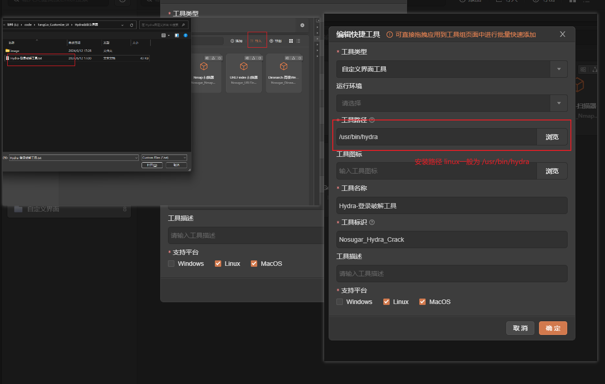
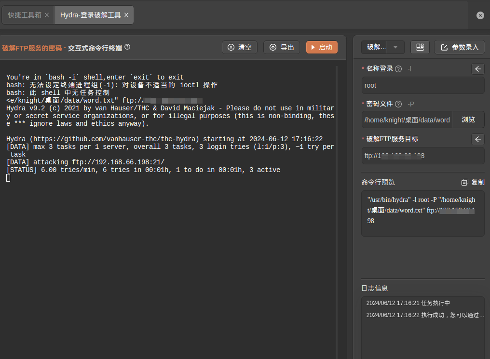
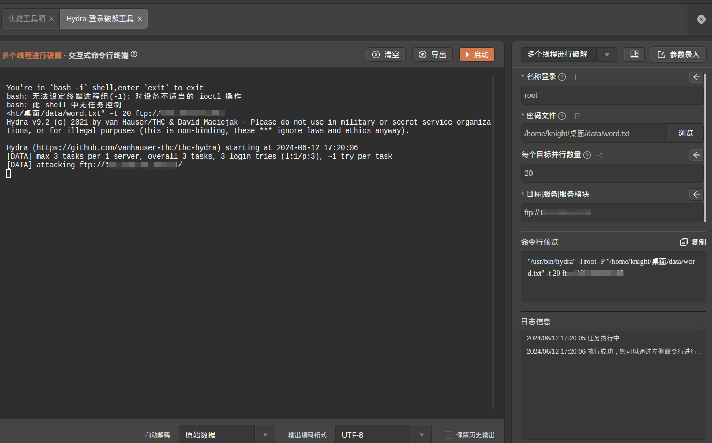
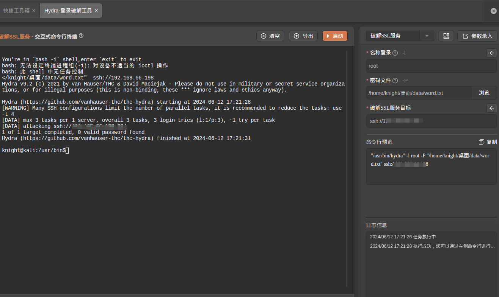

# Hydra

# 1. 简介
Hydra 是一个并行登录破解程序，支持多种协议 攻击。它非常快速和灵活，并且很容易添加新模块。
该工具使研究人员和安全顾问能够 展示未经授权访问系统是多么容易 远程。   
它支持：Cisco AAA、Cisco auth、Cisco enable、CVS、FTP、HTTP（S）-FORM-GET、 HTTP（S）-FORM-POST、HTTP（S）-GET、HTTP（S）-HEAD、HTTP-Proxy、ICQ、IMAP、IRC、 LDAP、MS-SQL、MySQL、NNTP、Oracle 侦听器、Oracle SID、PC-Anywhere、PC-NFS、 POP3、PostgreSQL、RDP、Rexec、Rlogin、Rsh、SIP、SMB（NT）、SMTP、SMTP 枚举、 SNMP v1+v2+v3、SOCKS5、SSH（v1 和 v2）、SSHKEY、Subversion、Teamspeak （TS2）、 Telnet、VMware-Auth、VNC 和 XMPP。
- 官网：[https://www.kali.org/tools/hydra/#hydra](https://www.kali.org/tools/hydra/#hydra)
- 工具版本：v9.2+
- 支持的TangGo版本：v1.4.8+
# 2. 使用方法
- 打开快捷工具，右上角点击导入，找到"Hydra自定义界面/Hydra-登录破解工具.txt"进行导入
- 配置工具路径,在"自定义界面"分组找到"Hydra-登录破解工具"，点击编辑.
- 选择Hydra实际路径，kali中自带hydra，linux系统通过文档[https://www.kali.org/tools/hydra/#hydra](https://www.kali.org/tools/hydra/#hydra) 进行安装 （Ubuntu使用 apt install hydra-gtk）
  
- 打开工具，选择模板，配置参数，启动  
# 3. 运行截图 
- 破解FTP服务密码   
  
- 批量破解多个服务器的密码   
  
- 破解SSL服务密码   
  