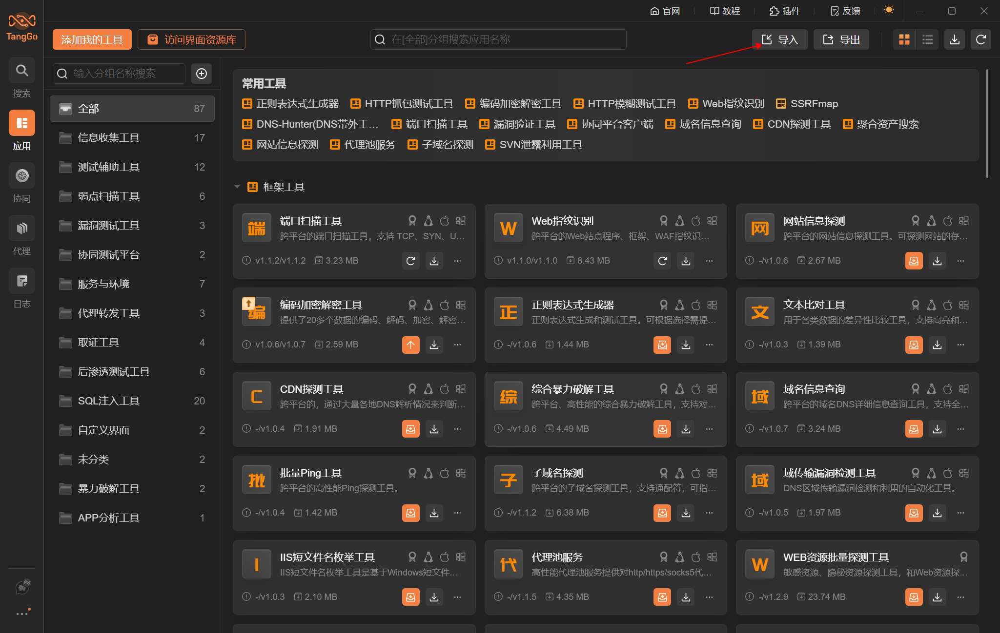
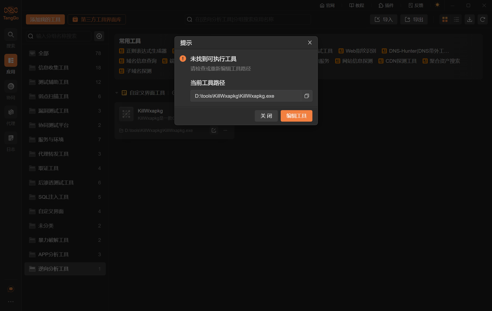
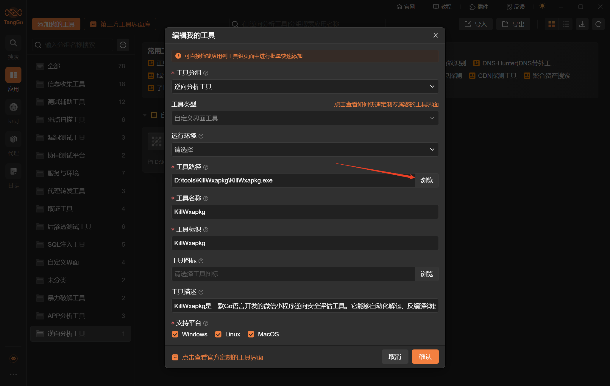
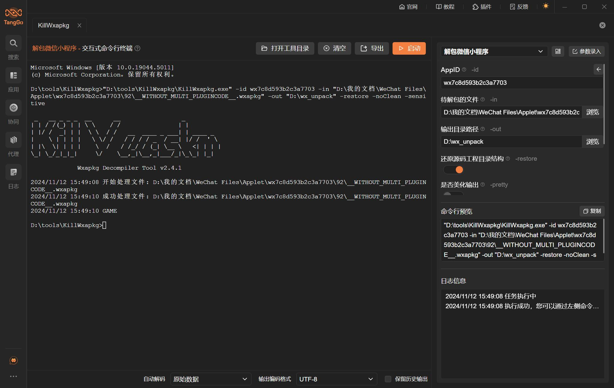
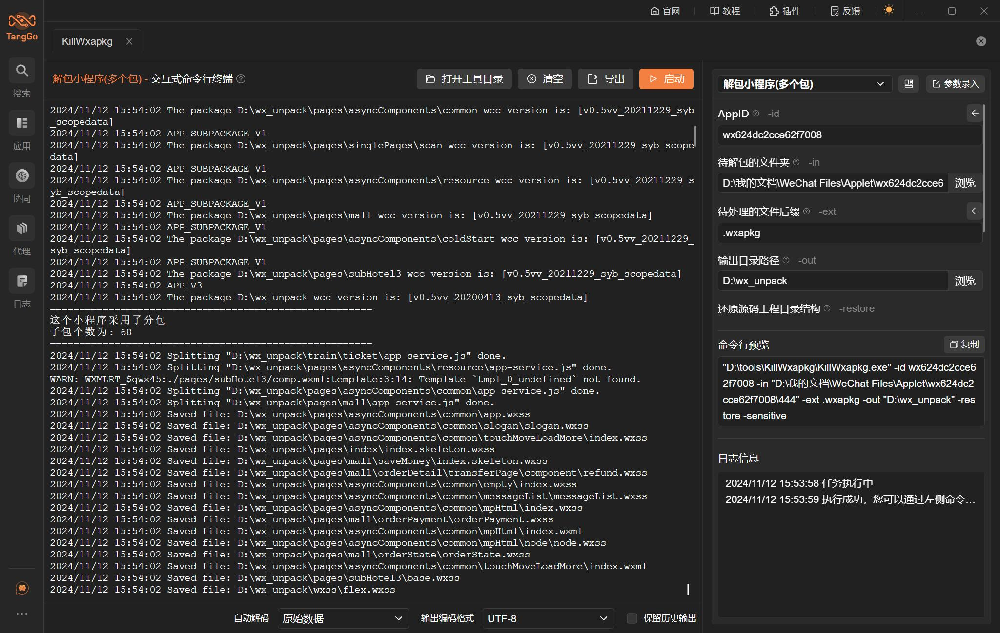
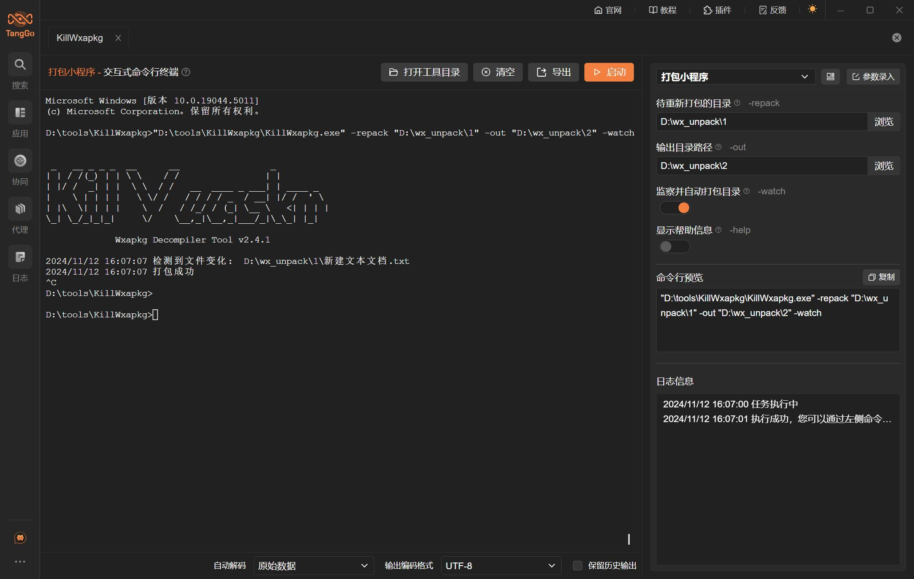

# KillWxapkg

# 1. 简介
KillWxapkg是一款Go语言开发的微信小程序逆向安全评估工具。它能够自动化解包、反编译微信小程序，可还原工程目录，支持小程序的Hook和修改、重打包等功能。

- 官网：[https://github.com/Ackites/KillWxapkg](https://github.com/Ackites/KillWxapkg)
- 支持的TangGo版本：v1.5.3+

# 2. 使用方法
- 安装界面：如果您是通过界面资源库进行安装的，免去此步骤。如果是本github下载安装，请在右上角点击导入，下载"KillWxapkg自定义界面/KillWxapkg.txt"进行导入，如下图所示：
  

- 下载工具：您可在KillWxapkg的官方Github上[https://github.com/Ackites/KillWxapkg/releases](https://github.com/Ackites/KillWxapkg/releases)下载已编译好的工具（您也可以下载源码自行编译），并解压缩到某个文件夹（建议路径必要包含空格和中文字符，虽然我们已经做了处理，但是不确定某些工具还是存在不兼容情况）

- 配置工具路径：通过搜索"KillWxapkg"或在全部分组的自定义界面工具类中找到"KillWxapkg"，双击或者点击右下角的编辑，修改KillWxapkg的工具路径为您下载工具的存放路径：
  
  
- 使用工具：配置测试目标地址和参数，点击启动按钮，如下图所示：
  
  
  
