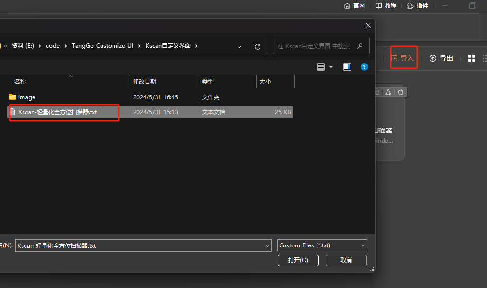
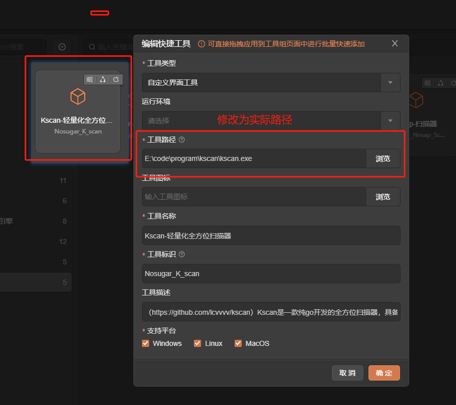
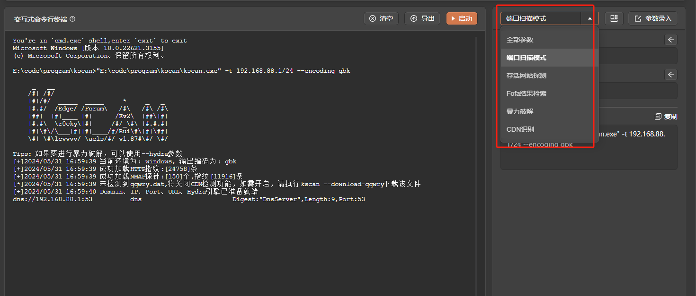
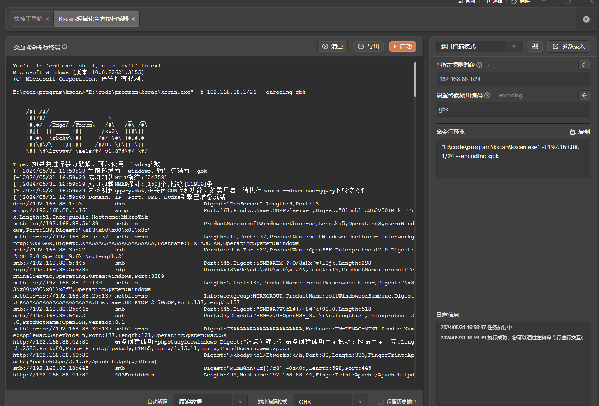
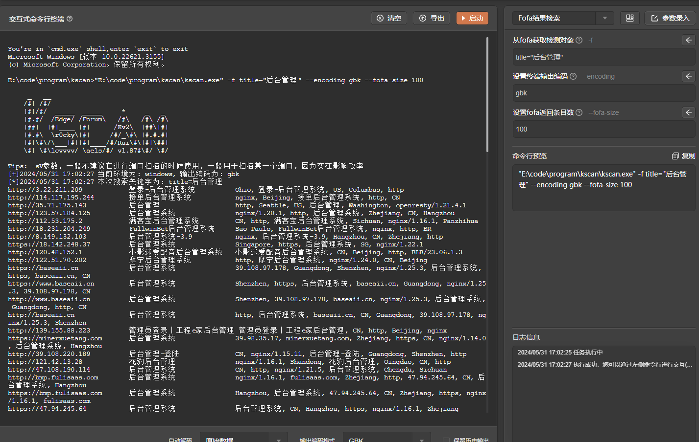
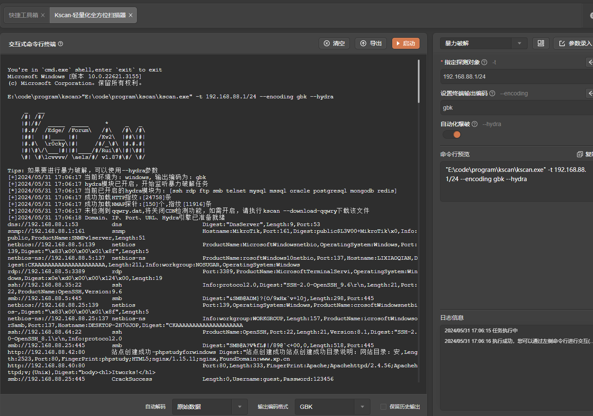

# kscan

# 1. 简介
Kscan是一款纯go开发的全方位扫描器，具备端口扫描、协议检测、指纹识别，暴力破解等功能。支持协议1200+，协议指纹10000+，应用指纹20000+，暴力破解协议10余种。
- 官网：[https://github.com/shadow1ng/fscan](https://github.com/shadow1ng/fscan)
- 工具版本：v1.87
- 支持的TangGo版本：v1.4.8+
# 2. 使用方法
- 安装界面：如果您是通过界面资源库进行安装的，免去此步骤。如果是本github下载安装，请下载"Kscan自定义界面/Kscan-轻量化全方位扫描器.txt"，在主界面的右上角点击导入按钮将该文件导入，如下图所示：
  
- 下载工具：请在官方Github下载工具，下载地址：[https://github.com/lcvvvv/kscan/releases](https://github.com/lcvvvv/kscan/releases)，下载后请将工具放置在一个不包含空格及中文、特殊字符的路径的目录下。
- 配置工具路径：在"自定义界面"分组找到"Kscan-扫描器"，点击编辑，配置工具路径为您下载的工具路径。
  
- 打开工具，选择模板，配置参数，启动
  
# 3. 运行截图
- 运行需设置  --encoding 字段 windows为gbk  linux和mac为utf-8 不然输出会乱码
- 端口扫描模式
  
- Fofa结果检索（需提前配置环境变量:FOFA_EMAIL(邮箱)、FOFA_KEY(key)）
  
- 暴力破解
 
