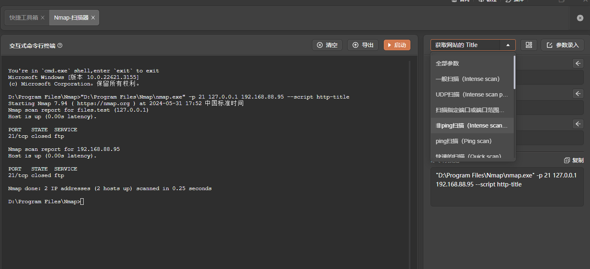
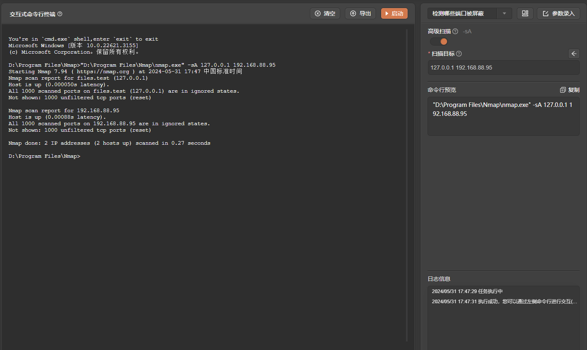

# nmap

# 1. 简介
nmap是一款针对大型网络的端口扫描工具，尽管它也适用于单机扫描。在不同情况下，你可能需要隐藏扫描、越过防火墙扫描或者使用不同的协议进行扫描，比如：UDP、TCP、ICMP 等。它支持：Vanilla TCP connect 扫描、TCP SYN（半开式）扫描、TCP FIN、Xmas、或NULL（隐藏）扫描、TCP ftp代理（跳板）扫描、SYN/FIN IP 碎片扫描（穿越部分数据包过滤器）、TCP ACK和窗口扫描、UDP监听ICMP端口无法送达扫描、ICMP扫描（狂ping）、TCP Ping扫描、直接RPC扫描（无端口映射）、TCP/IP指纹识别远程操作系统，以及相反身份认证扫描等。Nmap同时支持性能和可靠性统计，例如：动态延时计算，数据包超时和转发，并行端口扫描，通过并行ping侦测下层主机
- 官网：[https://nmap.org/](https://nmap.org/)
- 支持的TangGo版本：v1.4.8+
# 2. 使用方法
- 打开快捷工具，右上角点击导入，找到"Nmap自定义界面/Nmap-扫描器.txt"进行导入

- 配置工具路径，在"自定义界面"分组找到"Nmap-扫描器"，点击编辑，修改nmap安装实际路径，一般为安装路径下的nmap.exe(linux|mac为nmap)

- 打开工具，选择模板，配置参数，启动

# 3. 运行截图

- 获取网站title

- 检测那些端口被屏蔽

