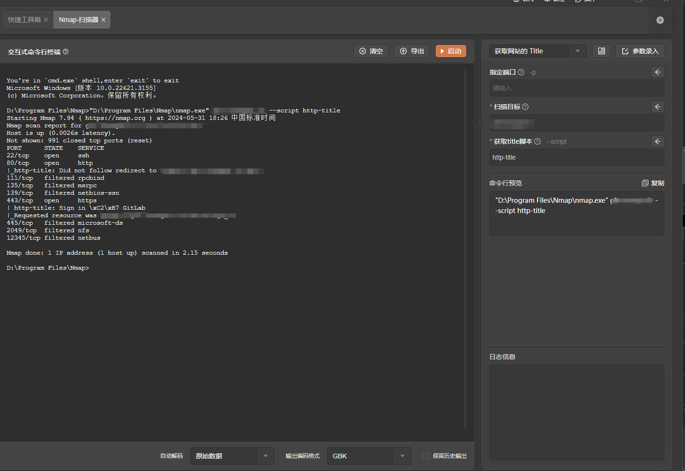

# nmap

# 1. 简介

NMap是一款功能强大的网络扫描器，用于网络发现和安全审计。它能够通过发送原始IP数据包，快速识别网络中的主机、服务、操作系统及其版本，并检测网络中的包过滤器和防火墙等安全措施。NMap不仅可以有效地扫描大型网络，还适用于单个主机的精细检测。除了基础的命令行扫描功能，NMap还配备了图形界面工具Zenmap、数据传输和调试工具Ncat、扫描结果比较工具Ndiff，以及数据包生成与响应分析工具Nping，使其成为一个全方位的网络管理和安全分析工具。

- 官网：[https://nmap.org/](https://nmap.org/)
- 工具版本： 7.94
- 支持的TangGo版本：v1.4.8+
# 2. 使用方法
- 打开快捷工具，右上角点击导入，找到"Nmap自定义界面/Nmap-扫描器.txt"进行导入

- 配置工具路径，在"自定义界面"分组找到"Nmap-扫描器"，点击编辑，修改nmap安装实际路径，一般为安装路径下的nmap.exe(linux|mac为nmap)

- 打开工具，选择模板，配置参数，启动

# 3. 运行截图

- 获取网站title

- 检测那些端口被屏蔽

