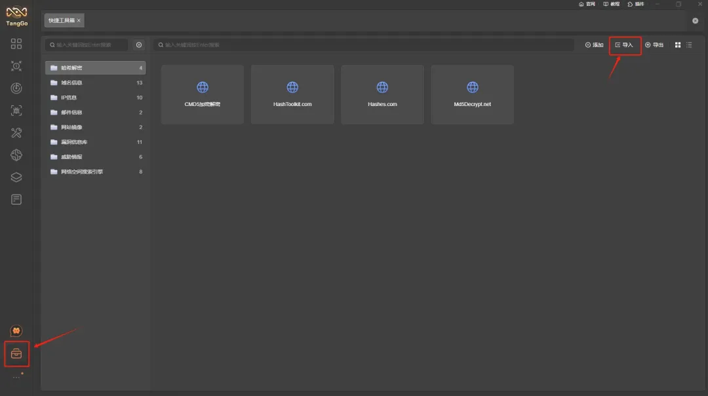
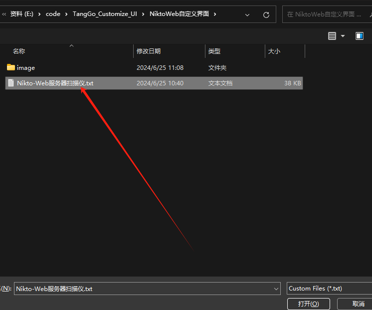
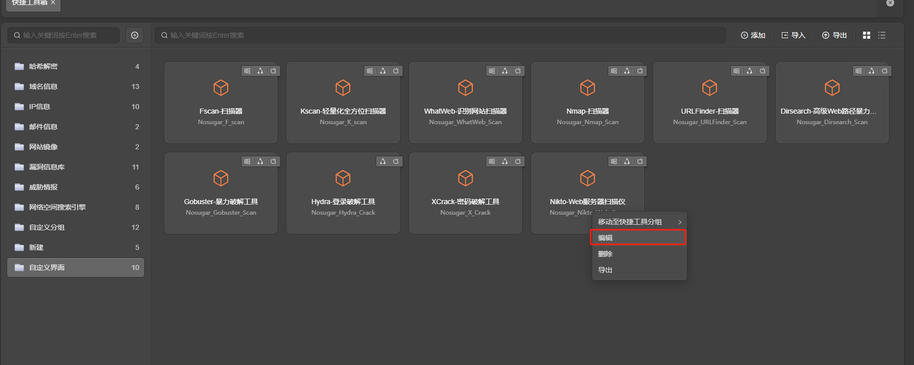
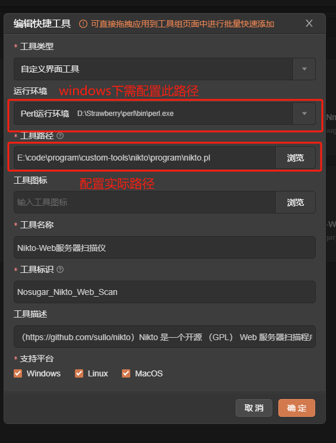
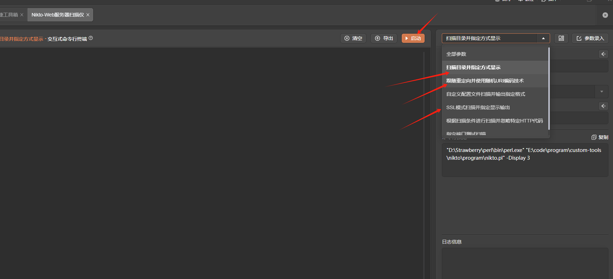
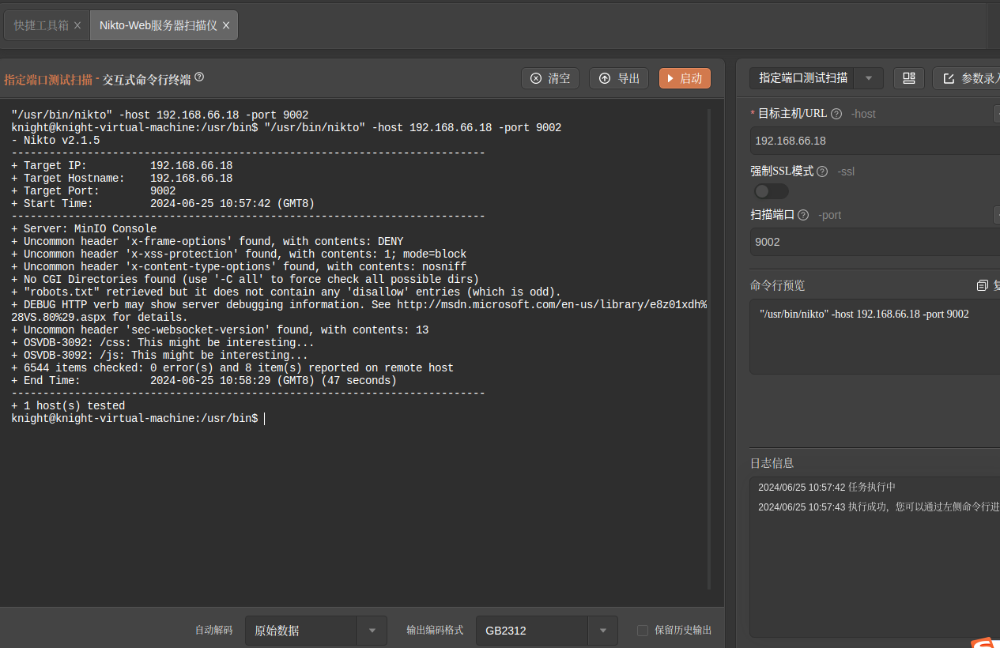
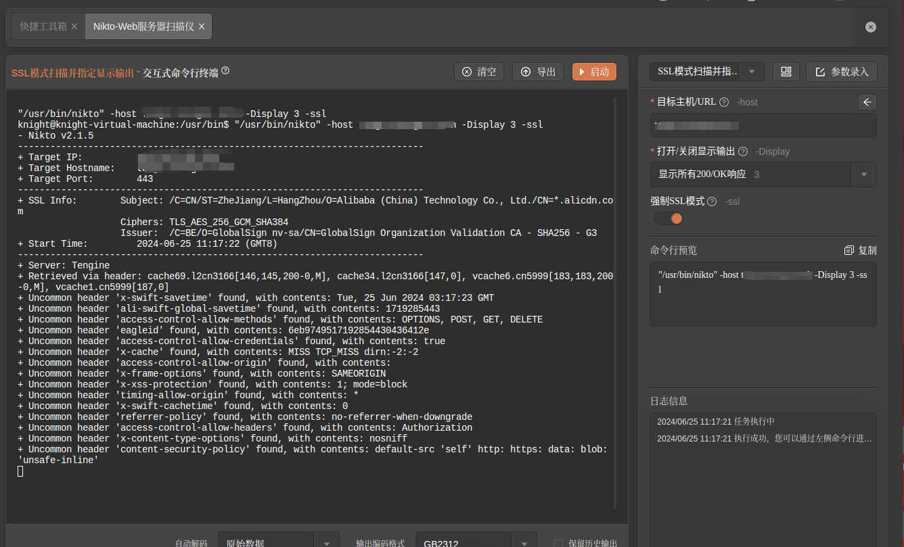

# Nikto

# 1. 简介
Nikto 是一个开源 （GPL） Web 服务器扫描程序，它对 Web 服务器的多个项目进行全面测试，包括 7,000 多个潜在危险的文件/程序，检查 1250 多个服务器的过时版本，以及 270 多个服务器上的版本特定问题。它还检查服务器配置项，例如是否存在多个索引文件、HTTP 服务器选项，并尝试识别已安装的 Web 服务器和软件。扫描项目和插件经常更新，并且可以自动更新。
- 官网：[https://cirt.net/Nikto2](https://cirt.net/Nikto2) 
- git地址：[https://github.com/sullo/nikto](https://github.com/sullo/nikto)
- 工具版本：V2.1.5+
- windows下perl环境版本：v5.3+
- 支持的TangGo版本：v1.4.8+
# 2. 使用方法
- 安装界面：如果您是通过界面资源库进行安装的，免去此步骤。如果是本github下载安装，请下载"NiktoWeb自定义界面/Nikto-Web服务器扫描仪.txt"，在主界面的右上角点击导入按钮将该文件导入。
   
   
- 配置运行环境：
  - windows需要下载和安装perl运行环境，通过官网(https://strawberryperl.com/)下载和安装perl运行环境，版本为v5.38.2
  - Linux和MacOS可以通过apt install nikto 或者 yum install nikto 进行安装，详情请查看文档：[https://github.com/sullo/nikto/wiki](https://github.com/sullo/nikto/wiki)  
- 下载工具：请在官网下载工具，下载地址：[https://github.com/sullo/nikto/releases](https://github.com/sullo/nikto/releases)
- 配置工具路径：在"自定义界面工具"分组找到"Nikto-Web服务器扫描仪"，点击编辑，将工具的目录修改为您的实际的工具所在目录（Linux和Mac 一般为: /usr/bin/nikto ） 
  
  
- 打开工具，选择模板，配置参数，启动   
  
# 3. 运行截图
- 指定端口扫描测试  
  
- SSL模式扫描并指定显示输出  
  

