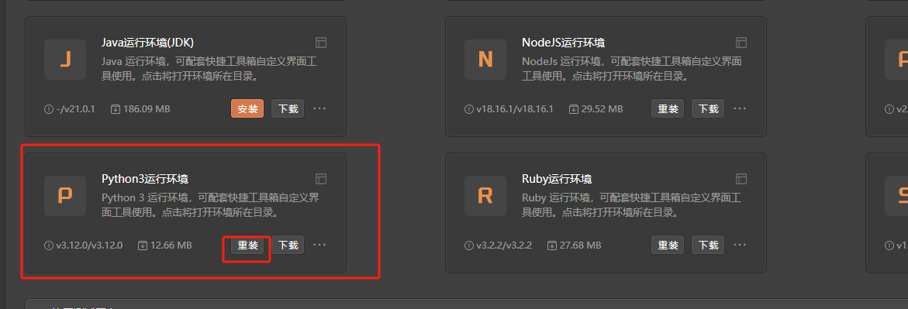

# SSRFmap

# 1. 简介
SSRFMap 是一个用于利用服务器端请求伪造（SSRF）漏洞的工具。它可以帮助安全研究人员和渗透测试人员自动化 SSRF 漏洞的利用过程。SSRFMap 支持多种协议（如 HTTP、Redis 和其他服务），并允许用户触发反向 shell、读取内部服务数据、进行端口扫描等操作。通过构建灵活的请求，SSRFMap 能有效地识别和利用内部网络中的潜在漏洞，从而增强安全测试的效率和准确性。它可以生成和利用种服务的攻击载荷，如：axfr、fastcgi、redis、github、zabbix、mysql、postgres、docker、smtp、portscan、networkscan、readfiles、alibaba、aws、gce、digitalocean、socksproxy、smbhash、tomcat、custom、memcache等。

- 官网：[https://github.com/swisskyrepo/SSRFmap](https://github.com/swisskyrepo/SSRFmap) 
- 支持的TangGo版本：v1.4.8+

# 2. 使用方法
- 安装界面：如果您是通过界面资源库进行安装的，免去此步骤。如果是本github下载安装，请在右上角点击导入，下载"SSRFmap自定义界面/SSRFmap.txt"进行导入，如下图所示： 
  

- 安装python内置环境，并双击打开 
  
  
- 下载工具：在SSRFmap的官方Github上[https://github.com/swisskyrepo/SSRFmap](https://github.com/swisskyrepo/SSRFmap)下载工具，并解压缩到某个文件夹（建议路径必要包含空格和中文字符，虽然我们已经做了处理，但是不确定某些工具还是存在不兼容情况）

- 配置工具路径：通过搜索"SSRFmap"或在全部分组的自定义界面工具类中找到"SSRFmap"，双击或者点击右下角的编辑，修改SSRFmap的工具路径为您下载工具的存放路径：
   
   
- 依赖安装：TangGo新版本(>=1.5.3)在点击“启动”按钮启动工具的时候会检查Python工具是否缺失依赖，如果缺失，会提示是否自动安装，免去了您手工安装依赖的麻烦，如下视频所示：

  

- 使用工具：配置测试目标地址和参数，点击启动按钮，如下图所示：
  

