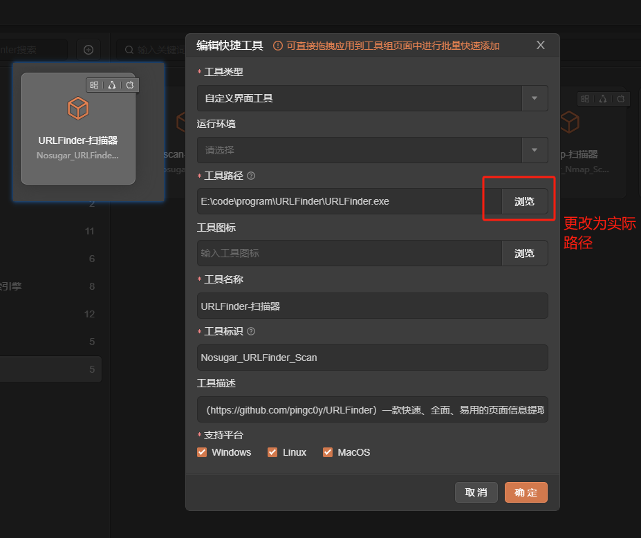
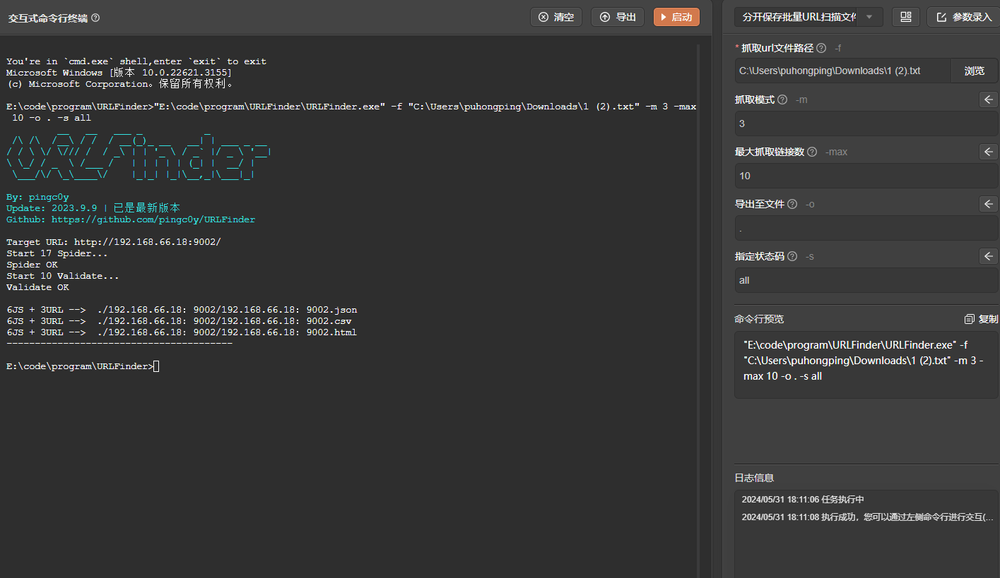

# URLFinder

# 1. 简介
一款快速、全面、易用的页面信息提取工具，可快速发现和提取页面中的JS、URL和敏感信息。
- 官网：[https://github.com/pingc0y/URLFinder](https://github.com/pingc0y/URLFinder) 
- 工具版本：2023.9.9 更新版本
- 支持的TangGo版本：v1.4.8+
# 2. 使用方法
- 打开快捷工具，右上角点击导入，找到"URLFinder自定义界面/URLFinder-扫描器.txt"进行导入
  
- 配置工具路径，在"自定义界面"分组找到"URLFinder-扫描器"，点击编辑，修改URLFinder实际路径
  通过[https://github.com/pingc0y/URLFinder/releases](https://github.com/pingc0y/URLFinder/releases)下载工具
  
- 打开工具，选择模板，配置参数，启动
  
# 3. 运行截图

- 指定状态码扫描
  
- 分开保存批量URL扫描文件
  
