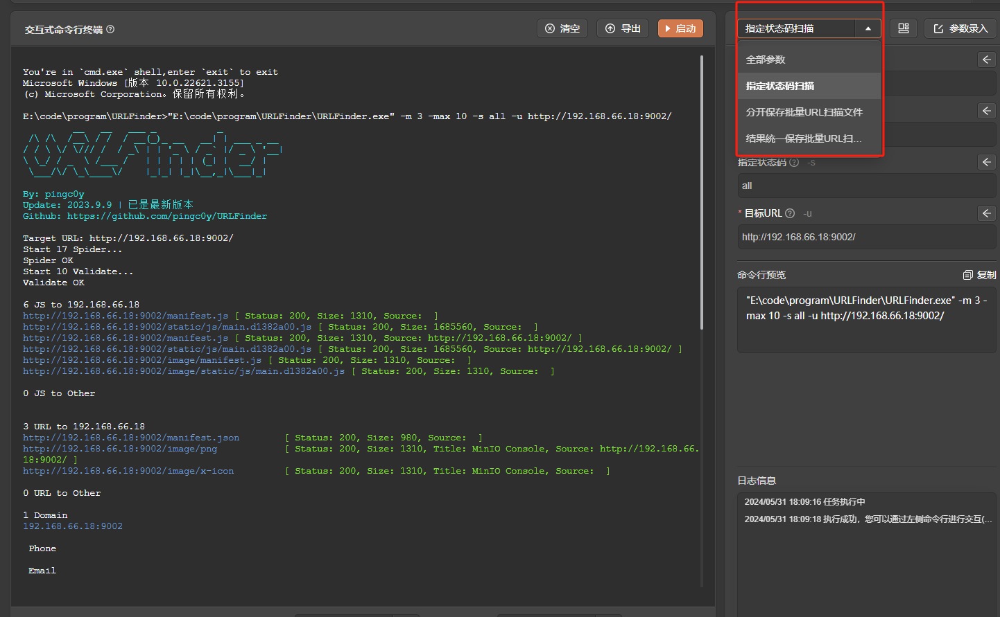

# URLFinder

# 1. 简介
一款快速、全面、易用的页面信息提取工具，可快速发现和提取页面中的JS、URL和敏感信息。
- 官网：[https://github.com/pingc0y/URLFinder](https://github.com/pingc0y/URLFinder) 
- 工具版本：2023.9.9 更新版本
- 支持的TangGo版本：v1.4.8+
# 2. 使用方法
- 安装界面：如果您是通过界面资源库进行安装的，免去此步骤。如果是本github下载安装，请下载"URLFinder自定义界面/URLFinder-扫描器.txt"，在主界面的右上角点击导入按钮将该文件导入，如下图所示：
  

  
- 下载工具：请在官方Github下载工具，下载地址：[https://github.com/pingc0y/URLFinder/releases](https://github.com/pingc0y/URLFinder/releases)，下载后请将工具文件放置在一个无中文或特殊字符的路径的目录下。
- 配置工具路径：在"自定义界面工具"或“信息收集工具”分组找到"URLFinder-扫描器"，点击编辑，修改URLFinder工具的路径为您下载的工具存储的实际路径
  
- 打开工具，选择模板，配置参数，启动
  
# 3. 运行截图

- 指定状态码扫描
  
- 分开保存批量URL扫描文件
  
