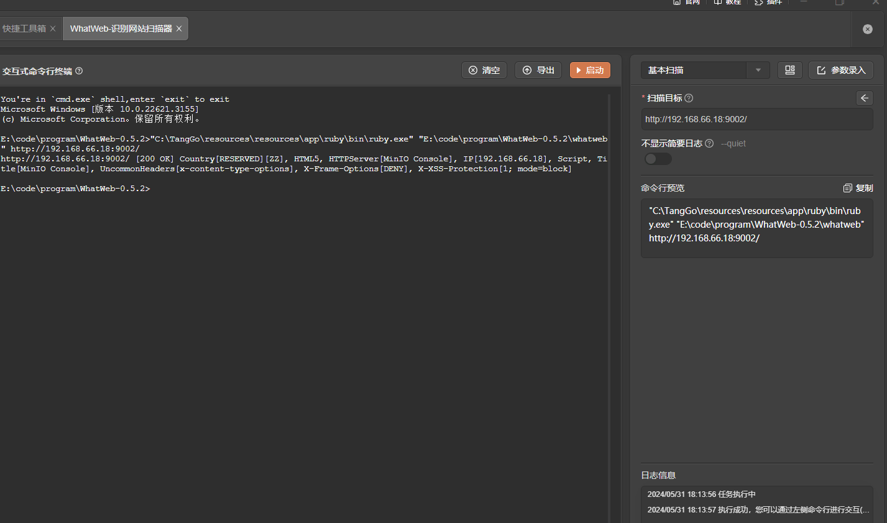

# WhatWeb

# 1. 简介
WhatWeb 识别网站。它的目标是回答这个问题，“那个网站是什么？WhatWeb 认可 Web 技术，包括内容管理系统 （CMS）、博客平台、统计/分析包、JavaScript 库、Web 服务器和嵌入式设备。WhatWeb 有超过 1800 个插件，每个插件都可以识别不同的东西。WhatWeb 还可以识别版本号、电子邮件地址、帐户 ID、Web 框架模块、SQL 错误等。

WhatWeb可以是隐蔽的和快速的，也可以是彻底的但缓慢的。WhatWeb 支持侵略性级别，以控制速度和可靠性之间的权衡。当您在浏览器中访问网站时，该交易包含许多提示，说明哪些 Web 技术正在为该网站提供支持。有时，单个网页访问包含足够的信息来识别网站，但当它没有时，WhatWeb 可以进一步询问该网站。默认的攻击级别称为“隐身”，是最快的，只需要一个网站的一个 HTTP 请求。这适用于扫描公共网站。开发了用于渗透测试的更具侵略性的模式。

大多数 WhatWeb 插件都是彻底的，可以识别从微妙到明显的一系列线索。例如，大多数 WordPress 网站都可以通过元 HTML 标签来识别，例如“”，但少数 WordPress 网站删除了这个识别标签，但这并不能阻止 WhatWeb。WordPress WhatWeb 插件有超过 15 项测试，包括检查网站图标、默认安装文件、登录页面以及检查相对链接中的“/wp-content/”。
- 官网：[https://github.com/urbanadventurer/WhatWeb](https://github.com/urbanadventurer/WhatWeb)
- 官方文档：[https://morningstarsecurity.com/research/whatweb](https://morningstarsecurity.com/research/whatweb)
- 工具版本：0.5.2
- 需要的Ruby环境版本：3.2.2+
- 支持的TangGo版本：v1.4.8+
# 2. 使用方法
- 安装界面：如果您是通过界面资源库进行安装的，免去此步骤。如果是本github下载安装，请在主界面右上角点击导入，下载"WhatWeb自定义界面/WhatWeb-识别网站扫描器.txt"进行导入
  
- 下载工具：请在官方Github下载工具，下载地址：[https://github.com/urbanadventurer/WhatWeb/releases](https://github.com/urbanadventurer/WhatWeb/releases)，下载后将工具相关的文件放在一个不包含中文、特殊字符的目录路径下。
- 配置运行环境：该工具需要ruby环境运行，您可以使用主框架内置的ruby环境（在服务与环境栏目一键安装），您也可以自行安装。
- 配置工具路径：在"自定义界面工具"或“信息收集工具”分组找到"WhatWeb-识别网站扫描器"，点击编辑，配置WhatWeb的路径为您的实际路径
 
- 在ruby安装目录下找到bundle，在WhatWeb工具目录下执行如下命令: ruby的安装路径\bin\bundle install，ruby初始化安装WhatWeb见官方文档：[https://morningstarsecurity.com/research/whatweb](https://morningstarsecurity.com/research/whatweb) 
- 打开工具，选择模板，配置参数，启动
  
# 3. 运行截图

- 基本扫描
  
- 文件中读取目标并扫描
  
