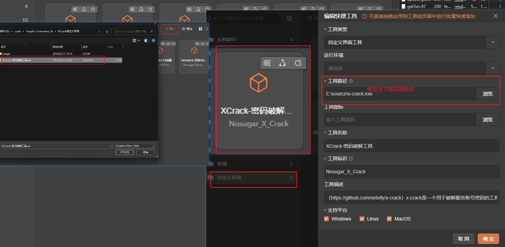
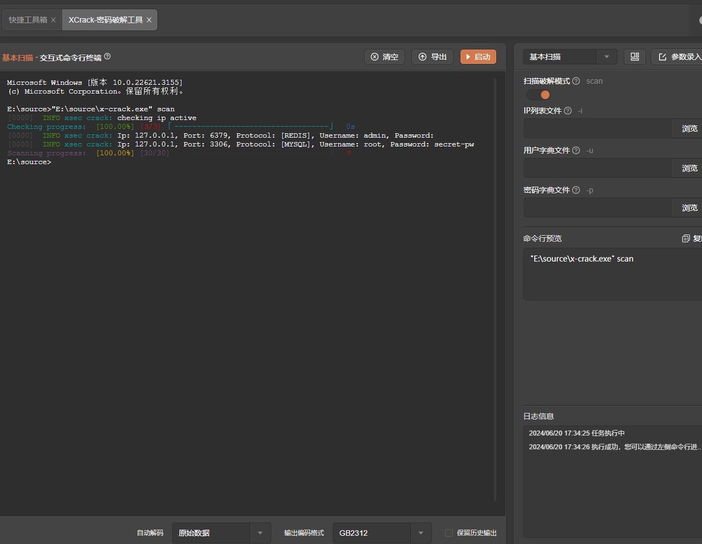

# X-Crack

# 1. 简介
X-Crack是一款弱口令扫描破解工具，通常用于测试密码强度或执行安全审计。它支持多种密码破解方式，包括字典攻击、暴力破解和混合攻击，支持FTP/SSH/SNMP/MSSQL/MYSQL/PostGreSQL/REDIS/ElasticSearch/MONGODB等协议。
- 官网：[https://github.com/netxfly/x-crack](https://github.com/netxfly/x-crack) 
- 工具版本：20171227
- 支持的TangGo版本：v1.4.8+
# 2. 使用方法
- 安装界面：如果您是通过界面资源库进行安装的，免去此步骤。如果是本github下载安装，请下载"XCrack自定义界面/XCrack-密码破解工具.txt"，在主界面的右上角点击导入按钮将该文件导入，如下图所示：
- 下载工具：请在官方Github下载工具，下载地址：[https://github.com/netxfly/x-crack/releases](https://github.com/netxfly/x-crack/releases)，下载后将工具放置在一个不包含空格、中文及特殊字符的路径下。
- 配置工具路径：在"暴力破解工具"或“自定义界面工具”分组找到"XCrack-密码破解工具"，点击编辑，将路径修改为您的工具实际路径：
 
- 打开工具，选择模板，配置参数，启动
# 3. 运行截图

- 基本扫描
  

